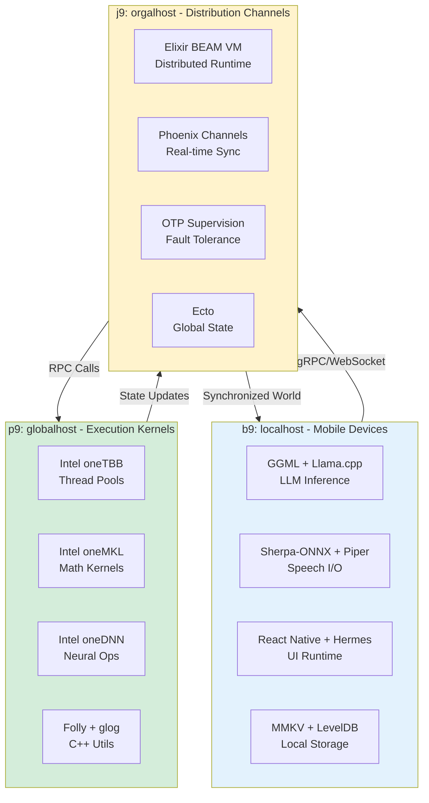

# The Three-Layer Distributed DTESN Architecture: Edge, Server, Network

**Date**: December 28, 2025
**Project**: `un9n` - Distributed Cognitive Architecture

## 1. The Question: What Are the "Holy Grail" Libraries?

You've identified the **mobile edge libraries** as the "back-end powerhouse" of the distributed, native client-side. Now the question is: what are the analogous "holy grail" libraries for the **server-side kernels** and **network-side channels**?

This maps directly to the **b9/p9/j9 framework**:

| Layer | Host Type | Role | File Type | Question |
|---|---|---|---|---|
| **b9** | `localhost` | Terminal nodes (edge devices) | b-files (binary) | ✅ **Answered**: Mobile AI stack (112+ libs) |
| **p9** | `globalhost` | Execution contexts (server kernels) | m-files (membrane) | ❓ **What are the kernel libs?** |
| **j9** | `orgalhost` | Distribution channels (network pipes) | dis-files (distributed) | ❓ **What are the channel libs?** |

## 2. Understanding the Analogy: Unwrapping the Layers

Your examples reveal the pattern:

### Node.js: V8 Isolates + libuv
- **V8**: JavaScript execution engine (the "brain")
- **libuv**: Event loop and async I/O (the "nervous system")
- **Node.js**: Type wrappers and API (the "interface")

**Pattern**: `Interface(Brain + NervousSystem)`

### PyTorch: ATen + TH + c10
- **c10**: Core tensor library (minimal, device-agnostic)
- **TH (Torch)**: Original tensor library (legacy)
- **ATen**: "A Tensor Library" - operator implementations
- **PyTorch**: Python bindings and autograd

**Pattern**: `Interface(OperatorLibrary(CoreTensor))`

From the c10 documentation, we see:
> "C10 is currently in development and will be the core library behind PyTorch. It will contain a tensor class and a dispatcher to run tensor operations and dispatch them to different devices. It is intentionally kept minimal and has only very few operations."

### Transformers (Hugging Face)
- **Spec-driven grammar**: Model architectures as composable components
- **Component library**: Every known transformer variant
- **Unified interface**: Consistent API across models

**Pattern**: `UnifiedAPI(ComponentGrammar(ModelZoo))`

## 3. The Three Layers: A Unified View

### Layer 1: Edge (b9 - localhost)
**Role**: Terminal execution nodes
**Your Stack**: Mobile AI libraries (GGML, Llama, Sherpa-ONNX, etc.)

**Characteristics**:
- Optimized for constrained resources (mobile, embedded)
- On-device inference and processing
- Minimal dependencies
- Hardware-accelerated (CPU/GPU/NPU)

### Layer 2: Server (p9 - globalhost)
**Role**: Execution context membranes (kernels)
**The "Holy Grail" Candidates**:

#### Option A: PyTorch Ecosystem (Python-centric)
- **c10**: Core tensor and dispatcher
- **ATen**: Operator library
- **TorchScript**: JIT compilation
- **LibTorch**: C++ frontend

**Strengths**:
- Battle-tested for ML workloads
- Excellent GPU support
- Rich ecosystem
- Python and C++ APIs

**Weaknesses**:
- Heavy runtime
- Python dependency for full features
- Not designed for distributed cognition

#### Option B: Ray + Modin (Distributed Python)
- **Ray Core**: Distributed execution framework
- **Ray Serve**: Model serving
- **Modin**: Distributed pandas

**Strengths**:
- Native distributed computing
- Actor model for stateful computation
- Excellent for ML pipelines

**Weaknesses**:
- Python-centric
- Not low-level enough for kernel work

#### Option C: Rust Ecosystem (Systems-level)
- **Tokio**: Async runtime (like libuv for Rust)
- **Actix**: Actor framework
- **Tonic**: gRPC framework
- **Rayon**: Data parallelism

**Strengths**:
- Memory safety without GC
- Zero-cost abstractions
- Excellent concurrency primitives
- Growing ML ecosystem (Candle, Burn)

**Weaknesses**:
- Smaller ML library ecosystem
- Steeper learning curve

#### Option D: C++ High-Performance Computing
- **Intel oneTBB**: Threading Building Blocks
- **Intel oneMKL**: Math Kernel Library
- **Intel oneDNN**: Deep Neural Network Library
- **Eigen**: Linear algebra library
- **Folly**: Facebook's C++ library (used by React Native)

**Strengths**:
- Maximum performance
- Direct hardware access
- Mature ecosystem
- Already integrated with your mobile stack (Folly, Hermes)

**Weaknesses**:
- Manual memory management
- More complex development

### Layer 3: Network (j9 - orgalhost)
**Role**: Distribution compute gradients (channels/pipes)
**The "Holy Grail" Candidates**:

#### Option A: Golang
- **Goroutines**: Lightweight concurrency
- **Channels**: CSP-style communication
- **net/rpc**: Built-in RPC
- **gRPC**: High-performance RPC framework

**Strengths**:
- Designed for distributed systems
- Simple concurrency model
- Fast compilation
- Single binary deployment

**Weaknesses**:
- Limited ML library ecosystem
- Garbage collection pauses
- Less expressive type system

#### Option B: Erlang/OTP
- **BEAM VM**: Distributed runtime
- **OTP**: Open Telecom Platform
- **Distributed Erlang**: Native clustering
- **Actor model**: Process isolation

**Strengths**:
- **THE** distributed systems language
- Fault tolerance built-in
- Hot code swapping
- Decades of telecom battle-testing

**Weaknesses**:
- Niche ecosystem
- Performance ceiling for compute-heavy tasks
- Unfamiliar syntax

#### Option C: Elixir
- **Built on BEAM**: All Erlang benefits
- **Phoenix Channels**: Real-time communication
- **Distributed clustering**: Native support
- **Modern syntax**: Ruby-like, more approachable

**Strengths**:
- All Erlang/OTP benefits
- Better developer experience
- Growing ecosystem
- Excellent for real-time systems

**Weaknesses**:
- Same performance limitations as Erlang
- Smaller than Go ecosystem

#### Option D: Rust + Tokio + Tonic
- **Tokio**: Async runtime
- **Tonic**: gRPC framework
- **async/await**: Ergonomic async
- **Zero-copy**: Efficient data transfer

**Strengths**:
- Performance comparable to C++
- Memory safety
- Growing distributed systems ecosystem
- Can call C/C++ libraries directly

**Weaknesses**:
- Steeper learning curve
- Smaller ecosystem than Go

## 4. The Optimal Stack for DTESN

Given your architecture and constraints, here's my recommendation:

### Edge (b9): ✅ Mobile AI Stack (Already Defined)
- GGML + Llama.cpp
- Sherpa-ONNX + Piper
- React Native + Hermes
- MMKV + LevelDB

### Server (p9): **C++ + Intel oneAPI + Folly**
**Why**:
1. **Continuity**: Your mobile stack already uses C++ (GGML, Llama) and Folly (React Native)
2. **Performance**: Maximum control over memory and execution
3. **Integration**: Direct compatibility with mobile libraries
4. **Maturity**: Intel oneAPI provides battle-tested HPC kernels

**Core Libraries**:
- **Intel oneTBB**: Thread-level parallelism (P-System membranes)
- **Intel oneMKL**: Math kernels (reservoir computations)
- **Intel oneDNN**: Neural network operations (LLM server)
- **Folly**: Facebook's C++ utilities (already in your stack)
- **glog**: Logging (already in your stack)
- **Eigen**: Linear algebra (if needed beyond oneMKL)

### Network (j9): **Elixir + Phoenix + OTP**
**Why**:
1. **Distributed by Design**: BEAM VM is built for distributed systems
2. **Fault Tolerance**: OTP provides supervision trees for resilience
3. **Real-time**: Phoenix Channels for synchronization
4. **Conceptual Fit**: Actor model aligns with DTESN's Agent-Arena-Relation

**Core Libraries**:
- **Elixir**: Modern syntax on BEAM VM
- **Phoenix**: Web framework with Channels
- **OTP**: Supervision, distribution, hot code swapping
- **Ecto**: Database abstraction (for global state)
- **libcluster**: Automatic cluster formation

**Alternative**: If you need maximum performance for network layer, use **Rust + Tokio + Tonic** instead.

## 5. The Complete Architecture

## 6. Mapping to DTESN Concepts

| DTESN Component | Edge (b9) | Server (p9) | Network (j9) |
|---|---|---|---|
| **Reservoir** | Mobile DTESN instance | Global reservoir state | Synchronization protocol |
| **Readout** | Local character actions | Aggregated narratives | Story distribution |
| **Dynamics** | On-device ESN | Server-side ESN core | Network-wide coherence |
| **Memory** | MMKV/LevelDB | Distributed hypergraph | Ecto database |
| **Execution** | Hermes JS VM | Intel oneTBB threads | BEAM VM processes |

## 7. Why This Stack?

### Performance
- **Edge**: Optimized for mobile constraints
- **Server**: C++ + Intel oneAPI = maximum throughput
- **Network**: Elixir/OTP = proven at telecom scale

### Conceptual Alignment
- **Edge**: Individual consciousness (mobile DTESN)
- **Server**: Collective unconscious (global reservoir)
- **Network**: Synchronization field (distributed coherence)

### Fault Tolerance
- **Edge**: Offline-first design
- **Server**: Redundant compute nodes
- **Network**: OTP supervision trees

### Scalability
- **Edge**: Millions of mobile devices
- **Server**: Horizontal scaling with load balancers
- **Network**: BEAM VM handles millions of concurrent connections

## 8. Alternative Considerations

If you want a **unified language** across all three layers:

### Option: Rust Everywhere
- **Edge**: Rust + wgpu (GPU) + tokio
- **Server**: Rust + Rayon + Candle (ML)
- **Network**: Rust + Tokio + Tonic (gRPC)

**Pros**: Memory safety, single language, excellent performance
**Cons**: Smaller ecosystem, steeper learning curve, less mature ML libraries

### Option: Go Everywhere
- **Edge**: Go mobile (limited)
- **Server**: Go + gRPC
- **Network**: Go + channels

**Pros**: Simple, fast compilation, good concurrency
**Cons**: Limited mobile support, GC pauses, weaker ML ecosystem

## Conclusion

For the **Unreal Echo Engine** vision, the optimal stack is:

- **b9 (Edge)**: C++ Mobile AI Stack ✅
- **p9 (Server)**: C++ + Intel oneAPI + Folly 🎯
- **j9 (Network)**: Elixir + Phoenix + OTP 🌐

This provides maximum performance where needed (edge and server), maximum reliability where critical (network), and conceptual coherence with the DTESN architecture.

The "holy grail" is not a single library, but a **triadic architecture** where each layer uses the optimal tool for its role, unified by clear interfaces (gRPC, WebSockets, Protocol Buffers).

## Library Stack Comparison: Edge vs Server vs Network

### Summary Table

| Aspect | Edge (b9 - localhost) | Server (p9 - globalhost) | Network (j9 - orgalhost) |
|---|---|---|---|
| **Primary Role** | Terminal execution nodes | Execution context membranes | Distribution compute gradients |
| **File Type** | b-files (binary) | m-files (membrane) | dis-files (distributed) |
| **Current Stack** | Mobile AI (112+ libs) | To be determined | To be determined |
| **Constraints** | Resource-limited, offline-first | High-performance, stateful | Fault-tolerant, real-time |

### Detailed Comparison

#### Edge Layer Analysis (b9)

**Confirmed Stack**: Mobile AI Libraries

| Category | Libraries | Purpose |
|---|---|---|
| LLM Inference | libllama.so, libggml.so, libexecutorch_llama_jni.so | On-device language generation |
| Speech Recognition | libsherpa-onnx-jni.so, libkaldi-decoder-core.so | Voice input |
| Speech Synthesis | libpiper_phonemize.so, libespeak-ng.so | Voice output |
| Image Generation | libsd-jni.so, libimagegenerator_gpu.so | Visual content creation |
| ML Inference | libtensorflowlite_jni_stable.so, libonnxruntime.so, libncnn.so | Neural network execution |
| Storage | libmmkv.so, liblvdb-jni.so | Persistent state |
| UI Runtime | React Native stack (30+ libs) | User interface |
| Math | libopenblas.so, libomp.so | Linear algebra |

**Characteristics**:
- Optimized for ARM/mobile processors
- Minimal dependencies
- Offline-capable
- Hardware-accelerated (CPU/GPU/NPU)

#### Server Layer Candidates (p9)

##### Option 1: C++ + Intel oneAPI
| Component | Library | Purpose |
|---|---|---|
| Threading | Intel oneTBB | Thread pools, parallel algorithms |
| Math Kernels | Intel oneMKL | BLAS, LAPACK, FFT |
| Neural Ops | Intel oneDNN | Convolution, pooling, activation |
| Utilities | Folly | Facebook C++ library (already in stack) |
| Logging | glog | Structured logging (already in stack) |

**Pros**: Maximum performance, direct hardware access, continuity with mobile stack
**Cons**: Manual memory management, complex development

##### Option 2: PyTorch/LibTorch
| Component | Library | Purpose |
|---|---|---|
| Core | c10 | Tensor class and dispatcher |
| Operators | ATen | Tensor operations |
| JIT | TorchScript | Ahead-of-time compilation |
| Frontend | LibTorch | C++ API |

**Pros**: Rich ML ecosystem, Python and C++ APIs, battle-tested
**Cons**: Heavy runtime, Python dependency for full features

##### Option 3: Rust + Tokio
| Component | Library | Purpose |
|---|---|---|
| Runtime | Tokio | Async runtime |
| Parallelism | Rayon | Data parallelism |
| ML | Candle, Burn | ML frameworks |
| Utilities | serde, tokio | Serialization, async |

**Pros**: Memory safety, zero-cost abstractions, growing ecosystem
**Cons**: Smaller ML library ecosystem, steeper learning curve

#### Network Layer Candidates (j9)

##### Option 1: Elixir + Phoenix + OTP
| Component | Library | Purpose |
|---|---|---|
| Runtime | BEAM VM | Distributed Erlang VM |
| Framework | Phoenix | Web framework with Channels |
| Distribution | OTP | Supervision, clustering |
| Database | Ecto | Database abstraction |
| Clustering | libcluster | Automatic node discovery |

**Pros**: Built for distributed systems, fault tolerance, real-time channels
**Cons**: Performance ceiling for compute-heavy tasks, niche ecosystem

##### Option 2: Golang
| Component | Library | Purpose |
|---|---|---|
| Concurrency | Goroutines | Lightweight threads |
| Communication | Channels | CSP-style messaging |
| RPC | gRPC | High-performance RPC |
| Clustering | etcd, consul | Service discovery |

**Pros**: Simple concurrency, fast compilation, single binary deployment
**Cons**: Limited ML ecosystem, GC pauses

##### Option 3: Rust + Tokio + Tonic
| Component | Library | Purpose |
|---|---|---|
| Runtime | Tokio | Async runtime |
| RPC | Tonic | gRPC framework |
| Serialization | serde, prost | Data serialization |
| Concurrency | async/await | Ergonomic async |

**Pros**: Performance comparable to C++, memory safety, zero-copy
**Cons**: Steeper learning curve, smaller ecosystem than Go

### Architectural Patterns

#### Node.js Pattern: Interface(Brain + NervousSystem)
- **V8**: JavaScript execution engine
- **libuv**: Event loop and async I/O
- **Node.js**: Type wrappers and API

#### PyTorch Pattern: Interface(OperatorLibrary(CoreTensor))
- **c10**: Core tensor library (minimal)
- **ATen**: Operator implementations
- **PyTorch**: Python bindings and autograd

#### Transformers Pattern: UnifiedAPI(ComponentGrammar(ModelZoo))
- **Spec-driven grammar**: Model architectures
- **Component library**: Transformer variants
- **Unified interface**: Consistent API

### Recommended Stack

Based on the analysis:

| Layer | Recommendation | Rationale |
|---|---|---|
| **Edge (b9)** | ✅ Mobile AI Stack | Already defined, optimized for mobile |
| **Server (p9)** | 🎯 C++ + Intel oneAPI + Folly | Continuity with mobile, maximum performance |
| **Network (j9)** | 🌐 Elixir + Phoenix + OTP | Built for distribution, fault tolerance |

**Alternative**: Use Rust everywhere for unified language and memory safety.
