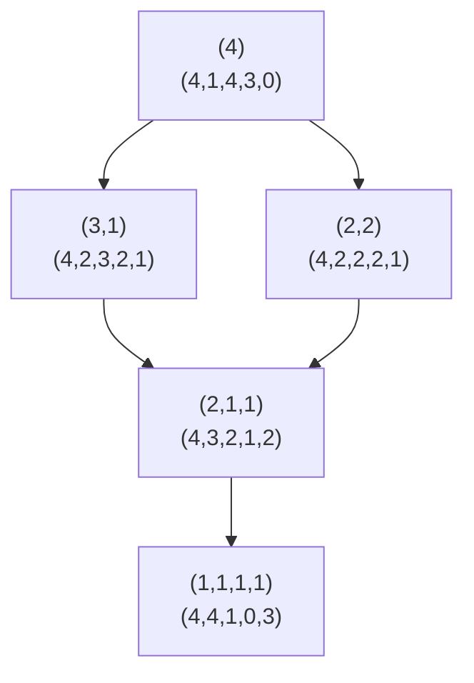
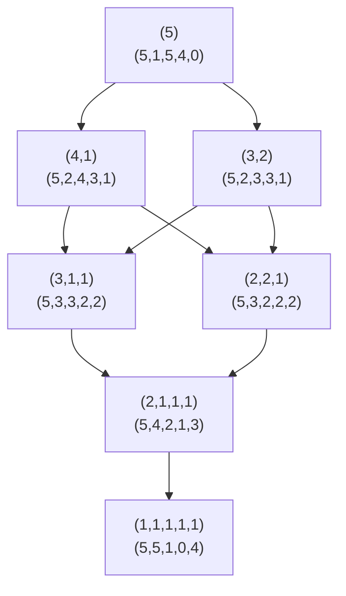

# Nestor DAG and Quantized Integer Formalism

## Overview

This document formalizes the **Nestor (Nested-Tensor) DAG** framework for representing integers as hierarchical multi-index objects. The core insight is that a "quantized integer" is not a scalar, but a **measure/tensor over a partition-tree** where each refinement level adds indices.

## 1. Core Objects

### 1.1 Integer Partition (Level-1 Object)

A partition of n is a nonincreasing list:

```
λ = (λ₁ ≥ λ₂ ≥ ... ≥ λₖ), where Σᵢ λᵢ = n
```

### 1.2 Nested-Tensor View

Treat each partition as a **ragged tensor shape**:

- **Outer length** = number of parts (k)
- **Values** = part sizes (λᵢ)

So:
```
λ ≡ NestedTensor₁: [λ₁, ..., λₖ]
```

### 1.3 Integer as Set of Partitions

Define:
```
𝒫(n) = {λ | λ ⊢ n}
```

This is the **set of all partitions** of n. Its size is the partition number p(n).

So the integer n is represented as:
```
n ⟼ 𝒫(n)
```

As a tensor container:
```
𝐏ₙ = NestedTensor[int]  (batch of variable-length rows)
```

## 2. Nestor DAG Structure

### 2.1 DAG Definition: Refinement/Split Edges

- **Nodes**: partitions of n
- **Edge**: λ → μ if μ is obtained by **splitting one part** of λ into ≥2 positive integers, then resorting

### 2.2 Per-Node Dimension Signature

For each partition λ = (λ₁, ..., λₖ), define a **dimension vector**:

```
dim(λ) = (n, k, max, n-k, k-1)
```

Where:
| Component | Name | Description |
|-----------|------|-------------|
| n | Mass (invariant) | Σᵢ λᵢ = n |
| k | Outer length | Number of parts (ragged width) |
| max | Max part size | λ₁ (inner extent proxy) |
| n-k | Raggedness | Distance from all-ones |
| k-1 | Split-depth | Graph distance from root (n) |

## 3. Dimension Signatures for N = 1..5

### N = 1
| Partition | dim(λ) |
|-----------|--------|
| (1) | (1, 1, 1, 0, 0) |

### N = 2
| Partition | dim(λ) |
|-----------|--------|
| (2) | (2, 1, 2, 1, 0) |
| (1,1) | (2, 2, 1, 0, 1) |

### N = 3
| Partition | dim(λ) |
|-----------|--------|
| (3) | (3, 1, 3, 2, 0) |
| (2,1) | (3, 2, 2, 1, 1) |
| (1,1,1) | (3, 3, 1, 0, 2) |

### N = 4
| Partition | dim(λ) |
|-----------|--------|
| (4) | (4, 1, 4, 3, 0) |
| (3,1) | (4, 2, 3, 2, 1) |
| (2,2) | (4, 2, 2, 2, 1) |
| (2,1,1) | (4, 3, 2, 1, 2) |
| (1,1,1,1) | (4, 4, 1, 0, 3) |

### N = 5
| Partition | dim(λ) |
|-----------|--------|
| (5) | (5, 1, 5, 4, 0) |
| (4,1) | (5, 2, 4, 3, 1) |
| (3,2) | (5, 2, 3, 3, 1) |
| (3,1,1) | (5, 3, 3, 2, 2) |
| (2,2,1) | (5, 3, 2, 2, 2) |
| (2,1,1,1) | (5, 4, 2, 1, 3) |
| (1,1,1,1,1) | (5, 5, 1, 0, 4) |

## 4. Quantized Integer as Tensor Over Paths

### 4.1 Refinement Tree and Nested-Index Address

A **path** is a sequence of refinement choices:
```
π = (i₁, i₂, ..., iₗ)
```

where each iₗ selects which split/refinement edge you took at level ℓ.

The nested address notation:
```
[i][[i][j]][[i][j][k]]...
```

is a **prefix-closed path encoding**: each deeper bracket adds one more refinement index.

### 4.2 Quantized Integer State

Define the **quantized integer state** as a function on paths:
```
Qₙ(π) ∈ ℝ  or  ℕ
```

Interpretation:
- Qₙ assigns a **weight/amplitude/multiplicity** to each refinement path
- n is no longer "one number", but a **distribution over refinement histories**

### 4.3 Nested-Tensor Container Form

```
Qₙ ∈ NestedTensor[NestedTensor[...[ℝ]]]
```

where depth is "refinement depth" and inner lengths are "branching factors at that node".

## 5. Dense Notation Conventions

### 5.1 Multi-Index Conventions

**Address (path) indices:**
```
𝐢₁:ₗ := (i₁, ..., iₗ) ∈ 𝒜ₙ,ₗ
```

**Empty address:**
```
𝐢₁:₀ = ∅,  Qₙ[] := Qₙ[∅]
```

### 5.2 Address-Sum Operator (Inverted-∨)

Define a **single aggregator** for "sum over all valid addresses":

```
⋁_{𝐢∈𝒜ₙ} (·) := Σₗ≥₀ Σ_{𝐢₁:ₗ∈𝒜ₙ,ₗ} (·)
```

This is the default "power-series index expansion" operator.

### 5.3 Operator Tower (Kronecker)

Declare:
```
× := ⊗
```

The tower operator for an address 𝐢₁:ₗ is:
```
𝒜_{𝐢₁:ₗ} := ⊗_{ℓ=1}^{L} A^{(ℓ)}_{iₗ}
```

By convention:
```
⊗_{ℓ=1}^{0} A^{(ℓ)}_{iₗ} := I  (identity at empty address)
```

## 6. Master Quantized Integer Expression

### 6.1 Address-Level Bilinear Payload

Let:
```
pₙ,𝐢 ∈ (ℝ^{dₗ})*, qₙ,𝐢 ∈ ℝ^{dₗ}
```

Then the quantized integer functional is:

```
┌─────────────────────────────────────────────────────────┐
│  Q(n) := ⋁_{𝐢∈𝒜ₙ} pₙ,𝐢 · 𝒜_𝐢 · qₙ,𝐢                     │
└─────────────────────────────────────────────────────────┘
```

Expanded:
```
Q(n) = Σₗ≥₀ Σ_{𝐢₁:ₗ∈𝒜ₙ,ₗ} pₙ,𝐢₁:ₗ (⊗_{ℓ=1}^{L} A^{(ℓ)}_{iₗ}) qₙ,𝐢₁:ₗ
```

### 6.2 Level-Factorized Form (Ultra-Dense)

If per-level vectors are used:
```
Q(n) = ⋁_𝐢 ∏_{ℓ=1}^{|𝐢|} (p^{(ℓ)}_{iₗ} A^{(ℓ)}_{iₗ} q^{(ℓ)}_{iₗ})
```

This is the densest "power-series-ish" form.

## 7. Prefix-Conditioned Address Sum

### 7.1 Address Extension Set

For a prefix π = i₁:ₖ, define:
```
Ext(π) := ⋃_{L≥k} {i₁:ₗ | iₗ ∈ Ch(i₁:ₗ₋₁) ∀ℓ > k}
```

This is: *all valid finite continuations of the prefix*.

### 7.2 Prefix-Conditioned Inverted-∨

```
┌─────────────────────────────────────────────────────────┐
│  ⋁_{𝐢⪰π} (·) := Σₗ≥|π| Σ_{𝐢₁:ₗ∈𝒜ₙ, 𝐢₁:|π|=π} (·)        │
└─────────────────────────────────────────────────────────┘
```

Where 𝐢 ⪰ π means "𝐢 extends π".

### 7.3 Conditional Quantized Integer

```
Q(n | i₁:ₖ) := ⋁_{𝐢⪰i₁:ₖ} pₙ,𝐢 · 𝒜_𝐢 · qₙ,𝐢
```

No nested ∨'s. No explicit depth index. No repeated child conditions.

## 8. Two Canonical Interpretations

### 8.1 Interpretation A: Operator-Valued (Weighted Sum of Kronecker Towers)

```
𝒬 = ⋁_{𝐢∈𝒜} [∏_{ℓ=1}^{|𝐢|} p^{(ℓ)}_{iₗ} A^{(ℓ)}_{iₗ} q^{(ℓ)}_{iₗ}] · [⊗_{ℓ=1}^{|𝐢|} A^{(ℓ)}_{iₗ}]
```

**Type:** 𝒬 is an **operator** (matrix/tensor).

### 8.2 Interpretation B: Scalar-Valued (Quantized Integer Number)

```
Q = ⋁_{𝐢∈𝒜} [(⊗_{ℓ=1}^{|𝐢|} p^{(ℓ)}_{iₗ})ᵀ (⊗_{ℓ=1}^{|𝐢|} A^{(ℓ)}_{iₗ}) (⊗_{ℓ=1}^{|𝐢|} q^{(ℓ)}_{iₗ})]
```

**Type:** Q ∈ ℝ (a scalar).

## 9. Shorthand Dictionary

| Symbol | Meaning |
|--------|---------|
| ⋁_𝐢 | Address sum (power-series) |
| 𝒜_𝐢 | Tower operator: ⊗_{ℓ=1}^{|𝐢|} A^{(ℓ)}_{iₗ} |
| 𝒜_∅ | Identity (empty address) |
| Qₙ[𝐢] | Component field: pₙ,𝐢 · 𝒜_𝐢 · qₙ,𝐢 |
| Q(n) | Quantized integer: ⋁_{𝐢∈𝒜ₙ} Qₙ[𝐢] |
| 𝐢 ⪰ π | 𝐢 extends prefix π |
| Ch(π) | Valid children indices at prefix π |
| Ext(π) | All valid finite extensions of π |

## 10. Mermaid Diagrams

### N = 4 Refinement DAG



### N = 5 Refinement DAG



## 11. Integration with Deep Tree Echo

### 11.1 Mapping to 12-Step Cognitive Loop

The Nestor DAG maps directly to the Deep Tree Echo cognitive architecture:

| Nestor Concept | Deep Tree Echo Mapping |
|----------------|------------------------|
| Partition (n) | Total cognitive workload |
| Parts λᵢ | Thread allocations |
| Refinement depth | Nesting level |
| Address path | Cognitive trace |
| Kronecker tower | Tensor bundle composition |

### 11.2 OEIS A000081 Alignment

The nesting levels follow A000081:
- N=1: 1 term (singular channel)
- N=2: 2 terms (opponent processing)
- N=3: 4 terms (2 orthogonal dyadic pairs)
- N=4: 9 terms (3 streams × 3 phases)

### 11.3 Thread Pool Scheduling

The quantized integer formalism enables optimal thread pool scheduling:

```
Q(workload) = ⋁_{partition} weight(partition) · schedule(partition)
```

Where the address-sum operator automatically explores all valid refinement paths.

## 12. References

- OEIS A000081: https://oeis.org/A000081
- Sigurd Andersen's S-Grams
- Robert Campbell's Cosmic Order System
- Deep Tree Echo Cognitive Architecture

---

*This document is part of the Deep Tree Echo project.*
