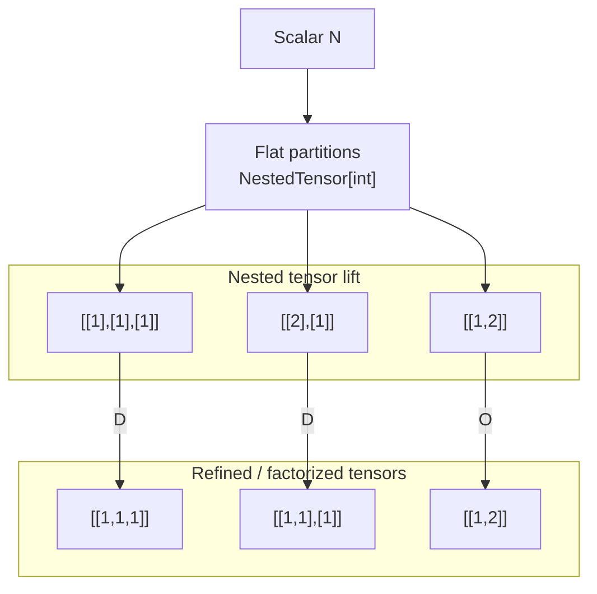

# OEIS A000081 Nested Tensor Partition System

## Overview

This document describes the integration of **integer partitions as nested tensors** into the Deep Tree Echo cognitive architecture. The core insight is that **integer partitions are tensor shapes, not numbers**, and the **partition lattice is a shape-DAG** for thread pool scheduling.

## Mathematical Foundation

### OEIS A000081: Rooted Trees

The sequence [OEIS A000081](https://oeis.org/A000081) counts the number of rooted trees with n unlabeled nodes:

| n | A000081(n) | Cognitive Interpretation |
|---|------------|--------------------------|
| 1 | 1 | Singular channel, undifferentiated |
| 2 | 2 | Opponent processing, universal-particular |
| 3 | 4 | 2 orthogonal dyadic pairs |
| 4 | 9 | 3 concurrent streams × 3 phases |
| 5 | 20 | Full cognitive expansion |
| 6 | 48 | Extended cognitive lattice |
| 7 | 115 | Deep recursive structure |

### Nesting Level to Term Count

The relationship between nesting level (N) and terms (T) follows A000081:

```
N=1: 1 term   (1 step apart)
N=2: 2 terms  (2 steps apart)
N=3: 4 terms  (3 steps apart)
N=4: 9 terms  (4 steps apart)
```

This maps directly to the 12-step cognitive loop with 3 concurrent streams.

## Core Concept: [6] = [2][3]

The canonical example of partition-to-tensor mapping:

```
6/36 = 1/6 → [6] = [2][3]
```

### Interpretation

1. **Primary ratio reduction**: `6/36 = 1/6`
   - Total space = 36
   - Active units = 6
   - Normalized: 1-of-6 partition (sampling ratio)

2. **Factorization of the reduced unit**: `[6] = [2][3]`
   - 6 is not atomic
   - Decomposes into two orthogonal components:
     - **2** (binary / dual / fork)
     - **3** (ternary / triplet / phase)

3. **Bracket notation `[ ]`** indicates structural identity:
   - `[6]` = a role, cell, class, or container
   - `[2][3]` = two independent axes (Cartesian product)

```
[6] ≅ [2] × [3]
```

This is a **product space**, not merely `2 * 3`.

## Partition as Nested Tensor

### Level 0 — Scalar
```
n
```

### Level 1 — Flat Integer Partition
```
n = [λ₁, λ₂, …, λₖ]
shape: (k,)
ragged: yes
```

### Level 2 — Nested / Factorized Partition
```
[6] → [2][3]
```

This lifts the representation into **nested tensor space**:
```
NestedTensor[
  NestedTensor[int]
]
```

Example:
```
12 = 6 + 4 + 2
→ [[2,3], [2,2], [2]]
```

## Partition Table Structure

The partition table encodes three coupled objects for each N:

1. **Additive partitions of N** (e.g., `3 = 1+1+1 = 2+1 = 3`)
2. **Multiplicity / weight propagation** (the rightmost integers: 1, 2, 4, 9…)
3. **Decomposition signatures** `{…}` with flags **O / D**

### O/D Flags (Structural Meaning)

| Flag | Tensor Meaning |
|------|----------------|
| **O** | New shape signature (Original) |
| **D** | Reshape/split of existing tensor (Derived) |
| **O+D** | Shape appears new but reducible |

This is **shape-DAG behavior**, not number theory.

### Example: N=7 Partitions

```
#N : 7
------------------------------------------------------------
7           [7]             {1}     9   O
6+1         [[2,3], 1]      {1,1}   2   
5+2         [[5], [2]]      {1,1}   2   
5+1+1       [[5], 1, 1]     {1,2}   1   
4+3         [[2,2], [3]]    {1,1}   2   D
4+2+1       [[2,2], [2], 1] {1,1,1} 1   D
4+1+1+1     [[2,2], 1, 1, 1]{1,3}   1   D
3+3+1       [[3], [3], 1]   {2,1}   1   
3+2+2       [[3], [2], [2]] {1,2}   1   
3+2+1+1     [[3], [2], 1, 1]{1,1,2} 1   
3+1+1+1+1   [[3], 1, 1, 1, 1]{1,4}  1   
2+2+2+1     [[2], [2], [2], 1]{3,1} 1   
2+2+1+1+1   [[2], [2], 1, 1, 1]{2,3}1   
2+1+1+1+1+1 [[2], 1, 1, 1, 1, 1]{1,5}1  
1+1+1+1+1+1+1 [1, 1, 1, 1, 1, 1, 1]{7}1 O D
```

## Thread Pool Mapping

### Partition → Thread Pool Configuration

| Partition Concept | Thread Pool Equivalent |
|-------------------|------------------------|
| Part sizes | Segment lengths |
| Refinement | Reshape / split |
| Additive partition | Inter-op task fan-out |
| Factorization `{a,b}` | Intra-op parallel split |
| Partition lattice | Scheduling DAG |

### Example: 6 Threads

```
6 = 3 + 2 + 1
→ Inter-op: 3 tasks
→ Intra-op: [3] = [3], [2] = [2], [1] = [1]

OR

6 = [2][3]
→ Inter-op: 1 task
→ Intra-op: 2×3 grid
```

## Integration with Echobeats 3-Stream Architecture

### Triad Step Groups

The 12-step cognitive loop is divided into 4 triads:

| Triad | Steps | Phase Offset |
|-------|-------|--------------|
| 0 | {1, 5, 9} | 0° |
| 1 | {2, 6, 10} | 30° |
| 2 | {3, 7, 11} | 60° |
| 3 | {4, 8, 12} | 90° |

### Partition-Based Scheduling

Each triad receives a partition of the total workload:

```
Total Workload: 36
Triad 0: 9 units → [3][3] or 3+3+3
Triad 1: 9 units → [3][3] or 3+3+3
Triad 2: 9 units → [3][3] or 3+3+3
Triad 3: 9 units → [3][3] or 3+3+3
```

The 3 concurrent streams (Cerebral, Somatic, Autonomic) map to the 3 phases within each triad.

## Zero-Sum Coordinate Systems

### 2M₁ (Line)
```
Each point on a line is referenced by coordinates (a,b).
The two coordinates for each point on the line add to zero.
```

### 3M₂ (Plane)
```
Each point in a 2-dimensional plane is referenced by coordinates (a,b,c).
The three coordinates for every point on the plane add to zero.
```

### 4M₃ (Tetrahedron)
```
Each point in 3-dimensional space is referenced by coordinates (a,b,c,d).
The four coordinates for every point in space add to zero.
```

This maps directly to the **4 tensor bundles** of Deep Tree Echo's tetrahedral cognitive architecture.

## Implementation

### Header: `NestedTensorPartitionSystem.h`

Key structures:
- `FPartitionPart`: A single part with optional factorization
- `FNestedPartition`: Full partition with signature and flags
- `FThreadPoolMapping`: Thread pool configuration
- `FCognitiveSchedule`: 12-step cognitive schedule

### Key Methods

```cpp
// Generate all partitions of N
std::vector<FNestedPartition> GeneratePartitions(uint32_t N);

// Map partition to thread pool
FThreadPoolMapping MapToThreadPool(const FNestedPartition& Partition, uint32_t NestingLevel);

// Generate cognitive schedule
FCognitiveSchedule GenerateCognitiveSchedule(uint32_t TotalWorkload, uint32_t NestingDepth);

// Decompose 6 into [2][3]
FNestedPartition DecomposeSix();
```

## Mermaid Diagram: Partition Lattice



## Key Takeaways

1. **Integer partitions are tensor shapes, not numbers.**
2. **The partition table is a shape-lattice with multiplicities.**
3. **O/D flags indicate cacheable vs non-cacheable shapes.**
4. **[6] = [2][3] is a product space, not a flat index.**
5. **The partition lattice is a scheduling DAG for thread pools.**

## References

- OEIS A000081: https://oeis.org/A000081
- Sigurd Andersen's N-Grams and S-Grams
- Robert Campbell's Cosmic Order System
- Deep Tree Echo Cognitive Architecture

---

*This document is part of the Deep Tree Echo project.*
