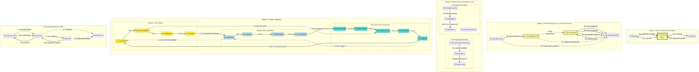

# Comprehensive Analysis: Relational Wholes (Rn) & Projections (Pk) in Cosmos System Architecture

**Author**: Manus AI  
**Date**: January 1, 2026  
**Version**: 1.0

---

## Executive Summary

This document provides a comprehensive analysis of **Relational Wholes (Rn)** and **Projections (Pk)** as they flow between **active interfaces** in the cosmos system architecture. The analysis is based on Robert Campbell's "Fisherman's Guide to the Cosmic Order," the cosmos-system-5 implementation, and domain-specific applications across neural networks, business organizations, reservoir computing, cellular biology, and integumentary systems.

**Key Findings:**

1. **Relational Wholes (Rn)** form **closed circuits** with **countercurrent balance** between subjective and objective flows, enabling feedback loops essential for adaptive behavior.

2. **Projections (Pk)** form **open paths** for **accounting** and **resource tracking**, implementing double-entry bookkeeping principles for system optimization.

3. **Active interfaces** (C1, C2, C3, C4) mediate between flows through **coalescence**, creating nested hierarchies that mirror neurological, organizational, and biological structures.

4. The **triadic architecture** (Cerebral, Somatic, Autonomic) implements **neurological reality** through three concurrent processing streams with mutually orthogonal symmetries.

5. **Dimensional flows** ([D-T], [P-O], [S-M]) organize **system-wide coordination** across potential, commitment, and performance dimensions.

---

## Table of Contents

1. [Foundational Concepts](#1-foundational-concepts)
2. [Active Interfaces (Centers)](#2-active-interfaces-centers)
3. [Relational Wholes (Rn): Detailed Analysis](#3-relational-wholes-rn-detailed-analysis)
4. [Projections (Pk): Detailed Analysis](#4-projections-pk-detailed-analysis)
5. [System Architecture: Three Triads](#5-system-architecture-three-triads)
6. [Dimensional Flow Mappings](#6-dimensional-flow-mappings)
7. [Tetrahedral Structure](#7-tetrahedral-structure)
8. [Implementation Patterns](#8-implementation-patterns)
9. [Domain-Specific Applications](#9-domain-specific-applications)
10. [Visual Diagrams](#10-visual-diagrams)
11. [Conclusion](#11-conclusion)
12. [References](#references)

---

## 1. Foundational Concepts

### 1.1 The Cosmic Order Framework

Robert Campbell's "Fisherman's Guide to the Cosmic Order" presents a systematic framework for understanding the structure of experience through nested hierarchies of active interfaces. The framework is grounded in the principle that **all active interfaces share a universal inside** (L0), and that energy efflux from this universal inside must complete circuits to form meaningful relationships.

The cosmos system operates through two fundamental mechanisms:

1. **Relational Wholes (Rn)**: Closed circuits of energy flow that create countercurrent balance between centers
2. **Projections (Pk)**: Open paths that project through multiple centers without forming closed circuits

These mechanisms work together to create a self-organizing, self-regulating system capable of adaptive behavior across multiple scales.

### 1.2 Nested Elaboration Sequence

The cosmos system evolves through a nested elaboration sequence following the OEIS A000081 pattern (number of rooted trees with n nodes):

- **System 1**: 1 term - Undifferentiated stream (1U1-perception)
- **System 2**: 2 terms - Dyadic opposition (2U1-perception ↔ 2P2-action)
- **System 3**: 4 terms - Tetrad with 2 orthogonal dyadic pairs
- **System 4**: 9 terms - Triadic concurrency with 3 threads, 12-step cycle
- **System 5**: Tetrahedral structure with 4 tensor bundles

Each level builds upon the previous, adding complexity while maintaining coherence through shared structural principles.

---

## 2. Active Interfaces (Centers)

### 2.1 The Four Centers

The cosmos system operates through four **active interfaces** or **centers** designated as:

**C1: Electronic/Idea Processes**
- **Nature**: Innermost, most subjective
- **Function**: Ideation, electronic signaling, abstract thought
- **Neurological**: Action potentials, synaptic transmission
- **Organizational**: Executive vision, strategic planning
- **Cellular**: Electrochemical gradients, ion channels

**C2: Cell/Knowledge Processes**
- **Nature**: Routine, known patterns, learned behaviors
- **Function**: Knowledge storage, pattern recognition, skill execution
- **Neurological**: Neural assemblies, synaptic weights
- **Organizational**: Institutional knowledge, standard operating procedures
- **Cellular**: Cytoplasm, organelles, metabolic pathways

**C3: Body/Routine Processes**
- **Nature**: Behavioral execution, physical manifestation
- **Function**: Motor control, routine execution, physical action
- **Neurological**: Motor neurons, muscle activation
- **Organizational**: Operational departments, production lines
- **Cellular**: Cell membrane, structural proteins

**C4: Environment/Form Processes**
- **Nature**: Outermost, most objective
- **Function**: Environmental interaction, physical form
- **Neurological**: Sensory receptors, external stimuli
- **Organizational**: Market conditions, customer interactions
- **Cellular**: Extracellular matrix, surrounding tissues

### 2.2 Coalescence

**Coalescence** is the mechanism by which two centers achieve mutual identity through mutual perception. When centers coalesce:

1. They maintain distinct identities while sharing a common perceptual core
2. Energy flows between them become bidirectional
3. They form a **relational whole** that enables countercurrent balance
4. They create a **pivot point** for perceptual transposition

**Types of Coalescence:**

- **Full Coalescence**: Two centers completely merge their perceptual cores (e.g., C1-C2 in expressive mode)
- **Partial Coalescence**: Two centers partially merge while maintaining distinct aspects (e.g., C2-C3 in goal term)
- **Transient Coalescence**: Temporary merging during mode transitions

---

## 3. Relational Wholes (Rn): Detailed Analysis

### 3.1 Definition and Properties

A **Relational Whole** is formed when **energy efflux from L0** (the universal inside) within one or more centers **completes a circuit back to L0** within another center. This creates a **closed loop** of energy flow that enables countercurrent balance.

**Essential Properties:**

1. **Closed Circuit**: Energy must return to its source (L0)
2. **Countercurrent Balance**: Forward and backward flows balance each other
3. **Bidirectional**: Information/energy flows in both directions
4. **Feedback Loop**: Creates adaptive, self-regulating behavior
5. **Pivot Point**: Requires a center that mediates between flows

### 3.2 System 2: Basic Countercurrent Pattern

In the fundamental **System 2** structure, two relational wholes form a **countercurrent balance**:

```
R1: C1 (Idea) → C2 (Routine) → C3 (Form)
    [Subjective direction: idea directs routines to give form]

R2: C3 (Form) → C2 (Routine) → C1 (Idea)
    [Objective feedback: form feeds back through sensory routines to idea]
```

**Interface Pivot**: C2 (Routine) acts as the **perceptual axis** that effects countercurrent balance between:
- Subjective idea directing from inside (R1)
- Objective form perceived outside (R2)

**Example: Making a Table**

When a carpenter makes a table:

- **R1 (Subjective)**: The table idea (C1) directs woodworking routines (C2) to shape wood into table form (C3)
- **R2 (Objective)**: The physical table form (C3) feeds back through sensory routines (C2) to refine the idea (C1)
- **Balance**: The routine interface (C2) balances the subjective idea with objective form through sensitive feedback

The countercurrent balance ensures that the form matches the idea through routines. The routine interface acts as the pivot that effects this balance.

### 3.3 System 3: Partial Coalescence and Idea Transference

In **System 3** and higher, the Universal Goal term (U2) introduces **partial coalescence** and multiple relational wholes:

**R1: Environmental Input → Body → Cells**
- Represents sensory input from environment
- Specific identity associated with environmental stimuli
- Feeds into cellular processes for integration

**R2: Cells → Body → Environment (implicit capacity)**
- Represents state of regeneration/readiness to respond
- Countercurrent to R1, balancing input with capacity
- Reflects the body's implicit capacity to respond to environment

**R3: Body (C3) assimilates Idea (C1) via partial coalescence with Cells (C2)**
- Idea transference into form
- Body processes assimilate idea via partial coalescence with cell processes
- Enables abstract ideas to manifest in physical form

**R4: Cell processes assimilate Environmental response (C4) via partial coalescence with Body (C3)**
- Form integration into idea
- Cell processes assimilate environmental response via partial coalescence with body
- Enables environmental feedback to inform cellular knowledge

**R5: Countercurrent motor response to R6 sensory input**
- Motor output balancing sensory input
- Creates motor-sensory feedback loop
- Essential for coordinated movement

**R6: Environmental stimuli → Body → Cells → Electronic processes**
- Sensory input pathway
- Transmits environmental information to electronic processes
- Completes the sensory-motor loop

**Key Insight**: The transference of idea to form achieves **mutual consistency** via the **partial coalescence** of body and cell processes (C2 ↔ C3). This partial coalescence acts as a **transference medium** that bridges the gap between abstract idea and concrete form.

### 3.4 System 4: Motor-Sensory Feedback Loops

In **System 4** motor control, relational wholes create **motor-sensory feedback loops** that enable rapid, adaptive responses to environmental stimuli.

#### T4E (Expressive Mode): Sensory Input

```
R1: Environment (C4) → Body (C3) → Electronic (C1) [via C1-C2 coalescence]
    [Touch stimulus from mosquito landing on skin]
    [Sensory neurons transmit electronic stimulus to spinal cord]

R2, R3: Body (C3) relates to Environment (C4) via Electronic-Cell coalescence
    [Sensory apparatus: body relates to physical environment via electronic processes of cells]
```

**Example: Mosquito Landing on Skin**

When a mosquito lands on Harry's arm:

1. The touch stimulus (C4) is transmitted through skin (C3)
2. Sensory neurons (C2) convert mechanical stimulus to electronic signals (C1)
3. The electronic stimulus is transmitted to the spinal cord
4. R1 represents the sensory pathway from environment to electronic processes
5. R2 and R3 represent the body's relationship to the environment via the sensory apparatus

#### T4R (Regenerative Mode): Motor Planning

```
R1: Proprioceptive feedback → Body (C3) → Cells (C2) [completed through C2, not C1]
    [Focuses on selection of cells rather than electronic stimulation]

R2, R3: Spindle simulation in C1-C2 coalescence representing body (C3) with respect to form (C4)
    [Fleeting dance inside arm/hand figuring out what to do next]
```

**Example: Planning to Swat Mosquito**

Before Harry swats the mosquito:

1. Muscle spindles provide proprioceptive feedback (C4) about body position (C3)
2. This feedback is completed through motor cells (C2), not electronic processes (C1)
3. R1 represents the proprioceptive feedback pathway
4. R2 and R3 represent the spindle simulation - a "fleeting dance" inside the arm/hand as Harry figures out what to do next
5. The simulation occurs in C1-C2 coalescence, representing the body with respect to environmental form

#### T2E (Interneuron Processing - Expressive)

```
R1: Environment (C4) → Body (C3) → Electronic (C1) superimposed on triad
    [Interneuron firing: idea of mosquito's touch superimposed on body-cell-electronic relationship]
```

**Example: Interneuron Activation**

When the mosquito touch is processed:

1. The environmental stimulus (C4) is transmitted through the body (C3)
2. It creates an electronic identity (C1) - the "idea" of the mosquito's touch
3. This idea is superimposed on the triad of body-cell-electronic processes
4. R1 represents the interneuron firing pattern that creates this idea

#### T2R (Interneuron Processing - Regenerative)

```
R1: Proprioceptive feedback (C4) → Body (C3) → Cells (C2)
    [Interneuron firing as simulated idea involving specific pattern of motor cells]

R2: Motor response directed toward Environment (C4) with identity in Electronic (C1)
    [Motor neurons projecting to muscles]

Motor-Sensory Balance: R1 ↔ R2 across Body interface (C3)
    [Balance occurs within context of cell processes C2 - no actual action yet]
```

**Example: Motor Neuron Selection**

As Harry prepares to swat:

1. Proprioceptive feedback (C4) informs body position (C3) and cell selection (C2)
2. R1 represents the interneuron firing as a simulated idea involving specific motor cells
3. R2 represents the motor response being directed toward the environment
4. The motor-sensory balance occurs across the body interface (C3)
5. This balance occurs within the context of cell processes (C2) - no actual action has occurred yet

**Key Insight**: The motor-sensory balance is not causally determined by synaptic junctions alone. Rather, **R1 and R2 must mutually balance the value of the response** across the body interface (C3). This balance ensures that motor responses are appropriate to sensory input, taking into account the body's current state and capabilities.

### 3.5 System 4: Muscle Activation (T5E/T5R)

#### T5R (Regenerative Mode): Motor Execution

```
R2: Hierarchy where initiating impulse proceeds from Cells (C2)
    [Muscle cells selected according to pattern of organization]
    [Reflects motor skills learned during formative years]

R1: Proprioceptive monitoring countercurrent to muscle activity (R2)
    [Sensory neurons in muscle spindles throughout arm/hand]
    [Changing environmental form (C4) → Body (C3) → Electronic (C1) → Cells (C2)]
```

**Example: Hand Moving to Swat**

As Harry's hand moves:

1. The initiating impulse proceeds from selected muscle cells (C2)
2. These cells are organized according to learned motor patterns
3. R2 represents the hierarchical motor command from cells to muscles
4. R1 represents proprioceptive monitoring - sensory feedback from muscle spindles
5. This feedback is countercurrent to the muscle activity (R2)
6. The feedback pathway: changing form (C4) → body (C3) → electronic (C1) → cells (C2)

#### T5E (Expressive Mode): Historical Integration

```
R2: Electronic (C1) → Cells (C2) → Body (C3) → Environmental form (C4)
    [Electronic processes direct cell processes which change body with respect to environmental form]
    [Incorporates historical sequence of preceding terms]
```

**Key Insight**: The direction implicit in R2 originates from electronic processes (C1), then to cells (C2), then to body (C3) in achieving formal identity with environment (C4). **R2 incorporates the historical sequence of preceding terms** that determines how it is directed. This means that the motor response is not just a simple reflex, but integrates the entire sequence of sensory input, motor planning, and cell selection that preceded it.

### 3.6 System 5: Cross-Triad Relational Wholes

In **System 5**, relational wholes extend across the three triads (Cerebral, Somatic, Autonomic), creating system-wide integration:

#### Intra-Triad Relational Wholes

Each triad has internal countercurrent balance:

**Cerebral Triad:**
```
R1_C: T-7 (Thought) → PD-2 (Coordination) → P-5 (Analysis) → O-4 (Output)
      [Forward flow: idea generation to structured output]

R2_C: O-4 (Output) → P-5 (Analysis) → PD-2 (Coordination) → T-7 (Thought)
      [Backward flow: output feedback to refine ideas]
```

**Somatic Triad:**
```
R1_S: S-8 (Sensory) → M-1 (Motor) → P-5 (Behavioral) → O-4 (Response)
      [Forward flow: sensory input to motor response]

R2_S: O-4 (Response) → P-5 (Behavioral) → M-1 (Motor) → S-8 (Sensory)
      [Backward flow: response feedback to refine sensing]
```

**Autonomic Triad:**
```
R1_A: M-1 (Monitoring) → S-8 (State Mgmt) → PD-2 (Process Dir) → P-5 (Emotive) → T-7 (Trigger)
      [Forward flow: monitoring to automatic triggers]

R2_A: T-7 (Trigger) → P-5 (Emotive) → PD-2 (Process Dir) → S-8 (State Mgmt) → M-1 (Monitoring)
      [Backward flow: trigger feedback to refine monitoring]
```

#### Inter-Triad Relational Wholes

Cross-triad flows create system-wide integration:

**R_CS (Cerebral → Somatic): Behavioral Directives**
```
O-4 (Cerebral Output) → S-8 (Somatic Sensory)
[Cognitive decisions direct behavioral actions]
```

**R_SA (Somatic → Autonomic): Performance Data**
```
O-4 (Somatic Response) → M-1 (Autonomic Monitoring)
[Behavioral performance informs system health monitoring]
```

**R_AC (Autonomic → Cerebral): Emotional Context**
```
T-7 (Autonomic Trigger) → T-7 (Cerebral Thought)
[Emotional states inform cognitive processing]
```

**R_CS2 (Somatic → Cerebral): Sensory Feedback**
```
S-8 (Somatic Sensory) → T-7 (Cerebral Thought)
[Sensory input informs idea generation]
```

**R_SA2 (Autonomic → Somatic): Triggers to Sensing**
```
T-7 (Autonomic Trigger) → S-8 (Somatic Sensory)
[Automatic triggers modulate sensory processing]
```

**R_AC2 (Cerebral → Autonomic): Executive to Background**
```
PD-2 (Cerebral Coordination) → PD-2 (Autonomic Process Dir)
[Executive control coordinates background processes]
```

**Key Insight**: The cross-triad relational wholes create a **tetrahedral structure** where each triad is a vertex, and the edges represent bidirectional flows. This structure enables:

1. **Concurrent processing** across three streams
2. **Mutual awareness** between streams
3. **Self-balancing** through countercurrent feedback
4. **Self-correcting** through cross-triad integration

### 3.7 Regenerative Mode (T8R): Resource Management

In the **Regenerative Mode**, relational wholes manage **resource allocation** and **system maintenance**:

```
R1: Environment (C4) → Body (C3) → Cells (C2)
    [Overall input: nourishment, rest, resources]
    [Associated with projections P1 in T8E of all particular sets]

R2: Cells (C2) → Body (C3) → Environment (C4) implicit capacity
    [State of regeneration: readiness to meet commitments]
    [Countercurrent balance for resource conservation]
```

**Mirrored Balance**: R1 and R2 are **mirrored across the interface** of body processes (C3) from subjective and objective perspectives.

**Cohesion Mechanism**: The mirrored balance is effected through the **cohesion of T8R with T6**, where the two terms **cohere or interact as one**. The countercurrent identities of T8R tunnel through the triad C1, C2, C3 in T6, linking them together in three pairs.

**Example: Harry's Sleep Deprivation**

When Harry is kept awake by the mosquito:

1. R1 represents the overall input from the environment - Harry had a good meal and went to bed early
2. R2 represents his body's capacity to respond - he's very tired and needs sleep
3. The countercurrent balance between R1 and R2 is a subjective concern within the context of his electrochemical processes (C1)
4. This balance may resonate with the historic integration of the culture, species, and evolution
5. T8R influences the overall motor pattern that emerges, potentially inhibiting activity to conserve resources

**Key Insight**: The regenerative mode implements a **balance sheet** for the entire organism, comparing projected revenues (R1) alongside projected expenditures (R2). This is analogous to double-entry bookkeeping in business, ensuring that resources are allocated appropriately and that the organism doesn't "operate at a loss."

---

## 4. Projections (Pk): Detailed Analysis

### 4.1 Definition and Properties

**Projections** represent **independent flows** through the center hierarchy that do not form closed circuits (relational wholes) but instead project through multiple centers in a **unidirectional manner**.

**Essential Properties:**

1. **Open Path**: Energy does not return to its source
2. **Unidirectional**: Flow proceeds in one direction only
3. **Independent**: Each projection operates independently
4. **Accounting**: Enables parallel tracking of inputs and outputs
5. **Balance Sheet**: Maintains resource allocation records

### 4.2 System 3: Independent Environmental Projections

In the Universal Goal term (U2), each center projects **independently** through environmental form:

```
P1: Projects from Center 1 (Electronic/Idea) through environmental form
P2: Projects from Center 2 (Cell/Knowledge) through environmental form
P3: Projects from Center 3 (Body/Routine) through environmental form
```

These projections **do not form closed circuits** but instead represent **independent influences** on the environment.

**Example: Making a Table (Projections)**

When making a table:

- **P1**: The idea of the table projects through the environment as an abstract concept
- **P2**: The knowledge of woodworking projects through the environment as technique
- **P3**: The routine of making projects through the environment as physical action

Each projection influences the environment independently, without forming a closed loop back to its source.

### 4.3 System 4: Accounting Projections (T8R Regenerative Mode)

The **Regenerative Mode** uses projections for **double-entry bookkeeping**:

```
P1: Environment (C4) → Body (C3) → Electronic (C1)
    [Reflects chemical input - supper being digested and nourishing cells]
    [Represents projected revenues]

P2: Cells (C2) → Electronic (C1)
    [Reflects chemical needs of cells]
    [Represents projected expenditures]
```

**Balance Sheet**: A comparison of projected revenues (P1) alongside projected expenditures (P2) creates a balance sheet in terms of electronic processes (the currency of chemical exchange).

**Example: Harry's Energy Balance**

When Harry goes to bed:

1. **P1 (Revenue)**: His supper is being digested inside his body, nourishing his cells from within, together with their electrochemical capabilities
2. **P2 (Expenditure)**: His cells have chemical needs that must be met to maintain their function
3. **Balance Sheet**: The comparison of P1 (revenues) vs P2 (expenditures) determines whether Harry's energies are being restored
4. **Imbalance**: The mosquito is causing Harry a very large energy debt through nervous upset and lack of sleep

**Key Insight**: The projections P1 and P2 run in **parallel** for comparison, just like the two columns of a balance sheet. This enables the system to track whether revenues (inputs) are sufficient to cover expenditures (outputs), and to adjust behavior accordingly.

### 4.4 System 4: Motor Control Accounting (T2E)

In the **Interneuron Term (T2E)**, projections provide double-entry bookkeeping for motor control:

```
P1: Environment (C4) → Body (C3) → Cells (C2) → Darkness (D)
    [Environmental feedback to sustain the body and its cells - assets]

P2: Electronic (C1) → Cells (C2) → Darkness (D)
    [Parallel commitment to electrochemical renewal of cells - liabilities]
```

**Double-Entry Bookkeeping**: Assets (P1) and liabilities (P2) are accounted for every step of the way. Sales (motor output) cannot exceed production capacity (metabolism).

**Example: Harry's Motor Balance**

As Harry prepares to swat the mosquito:

1. **P1 (Assets)**: Environmental feedback to sustain the body and its cells - Harry must eat
2. **P2 (Liabilities)**: Parallel commitment to electrochemical renewal of cells - Harry's metabolism keeps him going
3. **Balance**: The motor balance to sensory input is essential, given the immense complexity of synaptic junctions
4. **Constraint**: Sales can't perform at a loss - costs must be offset by revenues

**Key Insight**: Motor responses are not causally determined in a rigid manner by synaptic junctions. Rather, **R1 and R2 must mutually balance the value of the response** across the body interface (C3), while **P1 and P2 must maintain the balance sheet** of energy expenditure. At the same time, the expended energy debt must be replenished by independent feedback from the environment in the form of food and rest.

### 4.5 System 5: Cross-Triad Projection Flows

In **System 5**, projections extend across the three triads, implementing system-wide resource allocation:

#### Triad-Specific Projections

**Cerebral Triad:**
```
P1_C: External requests → Gateway → T-7 → PD-2 → P-5 → O-4
      [Input flow: user requests through cognitive processing]

P2_C: O-4 → Gateway → External response
      [Output flow: cognitive results to users]
```

**Somatic Triad:**
```
P1_S: Environment → S-8 → M-1 → P-5 → O-4
      [Sensory input flow: environmental data]

P2_S: O-4 → Environment
      [Motor output flow: behavioral responses]
```

**Autonomic Triad:**
```
P1_A: System metrics → M-1 → S-8 → PD-2 → P-5 → T-7
      [Monitoring input flow: system health data]

P2_A: T-7 → System responses
      [Trigger output flow: automatic responses]
```

#### Integration Layer Projections

**API Gateway (Central Nervous System):**
```
P_Gateway_In: External → Gateway → Triads
              [Implements Pk flows through request-response patterns]

P_Gateway_Out: Triads → Gateway → External
               [Tracks input-output accounting for all external interactions]
```

**Event Bus (Neural Pathways):**
```
P_Event: Triad_A → Event Bus → Triad_B
         [Implements Pk flows for inter-triad communication]
         [Maintains parallel tracking of cross-triad messages]
```

**Resource Allocation:**
```
P_Resource_In: External resources → System
               [Manages resource allocation across triads]

P_Resource_Out: System → External outputs
                [Balances input (P_In) vs output (P_Out) for optimization]
```

**Key Insight**: The cross-triad projections implement a **distributed accounting system** where each triad maintains its own balance sheet (P1 vs P2), while the integration layer maintains a **system-wide balance sheet** (P_In vs P_Out). This enables:

1. **Local optimization** within each triad
2. **Global optimization** across the entire system
3. **Resource allocation** based on current needs and capacities
4. **Contingency planning** for imbalances

---

## 5. System Architecture: Three Triads

The cosmos-system-5 implements a **triadic architecture** mirroring the human nervous system. This architecture is based on the neurological reality of three concurrent processing streams: Cerebral (executive functions), Somatic (motor control), and Autonomic (background processes).

### 5.1 Cerebral Triad (Yellow) - Neocortex Executive Functions

**Polarity Focus**: Potential (Creative Ideation)

**Services/Functions:**
- **T-7** (Thought Service): Right Hemisphere - Intuitive idea generation, creative potential, pattern recognition
- **PD-2** (Processing Director): Central coordination, executive control, resource management
- **P-5** (Processing Service): Analytical processing, logical analysis, structured thinking
- **O-4** (Output Service): Left Hemisphere - Structured output, applied techniques, formatted responses

**Neurological Mapping:**
- **Right Hemisphere** → Intuitive Ideas (Potential)
- **Left Hemisphere** → Applied Techniques (Commitment)
- **Processing Director** → Central Coordination (Executive Control)
- **Corpus Callosum** → Integration between hemispheres

**Dimensional Flow:**
- **[D-T] Potential**: PD-2 (Development) → T-7 (Treasury of ideas)
- **[P-O] Commitment**: P-5 (Production) → O-4 (Organization)
- **[S-M] Performance**: Indirect - through processing quality and output quality

**Example: Strategic Planning**

When a company develops a strategic plan:

1. **T-7 (Thought)**: Generates creative ideas about future directions
2. **PD-2 (Coordination)**: Coordinates these ideas with available resources
3. **P-5 (Analysis)**: Analyzes the feasibility and implications of each idea
4. **O-4 (Output)**: Produces a structured strategic plan document

### 5.2 Somatic Triad (Light Blue) - Basal System Motor Control

**Polarity Focus**: Commitment (Action Implementation)

**Services/Functions:**
- **M-1** (Motor Control): Action coordination, movement sequencing, voluntary motor control
- **S-8** (Sensory Service): Environmental input processing, perception, sensory integration
- **P-5** (Processing Service): Behavioral technique implementation, skill execution
- **O-4** (Output Service): Motor response delivery, action execution, behavioral output

**Neurological Mapping:**
- **Basal System** → Somatic Balance (Performance)
- **Motor Control** → Voluntary Movement (Striatum, Motor Cortex)
- **Sensory Processing** → Environmental Adaptation (Sensory Cortex, Thalamus)
- **Spinal Cord** → Motor-Sensory Integration

**Dimensional Flow:**
- **[D-T] Potential**: Shared from Autonomic - PD-2 (Background) → T-7 (Motor Memory)
- **[P-O] Commitment**: P-5 (Production) → O-4 (Organization)
- **[S-M] Performance**: S-8 (Sales/Sensory) → M-1 (Market/Motor)

**Example: Playing Piano**

When a pianist plays a piece:

1. **S-8 (Sensory)**: Processes visual input from the sheet music and auditory feedback from the piano
2. **M-1 (Motor)**: Coordinates finger movements to press the correct keys
3. **P-5 (Behavioral)**: Implements learned techniques for playing specific passages
4. **O-4 (Response)**: Delivers the motor response - fingers pressing keys to produce music

### 5.3 Autonomic Triad (Turquoise) - Limbic System Background Processes

**Polarity Focus**: Performance (System Maintenance)

**Services/Functions:**
- **M-1** (Monitoring Service): System health monitoring, vital signs, performance metrics
- **S-8** (State Management): Emotional state, memory, context management, limbic processing
- **PD-2** (Process Director): Background process orchestration, homeostatic regulation
- **P-5** (Processing Service): Emotive processing, intuitive responses, subconscious analysis
- **T-7** (Trigger Service): Automatic responses, reflexive reactions, emergency triggers

**Neurological Mapping:**
- **Limbic System** → Emotive Balance (Performance)
- **Autonomic Monitoring** → Background Maintenance (Hypothalamus, Brainstem)
- **Trigger Responses** → Reflexive Actions (Amygdala, Autonomic Nervous System)
- **Hippocampus** → Memory and Context

**Dimensional Flow:**
- **[D-T] Potential**: PD-2 (Development) → T-7 (Treasury of reflexes)
- **[P-O] Commitment**: P-5 (Production) → Indirect through triggers
- **[S-M] Performance**: S-8 (Sales/State) → M-1 (Market/Monitoring)

**Example: Stress Response**

When a person encounters a stressful situation:

1. **M-1 (Monitoring)**: Monitors vital signs - heart rate, blood pressure, cortisol levels
2. **S-8 (State Mgmt)**: Manages emotional state - anxiety, fear, arousal
3. **PD-2 (Process Dir)**: Orchestrates background processes - activates sympathetic nervous system
4. **P-5 (Emotive)**: Processes emotional significance of the stressor
5. **T-7 (Trigger)**: Triggers automatic responses - fight-or-flight, increased alertness

### 5.4 Shared Services and Polarity Mapping

The three triads share certain services, reflecting the neurological reality of shared neural structures:

**P-5 (Processing Service): Shared by ALL Triads**
- **Cerebral P-5**: Analytical processing, logical analysis
- **Somatic P-5**: Behavioral processing, skill execution
- **Autonomic P-5**: Emotive processing, intuitive responses
- **Integration**: P-5 acts as a central integration hub, enabling cross-triad coordination

**PD-2 (Process Director): Shared by Cerebral & Autonomic**
- **Cerebral PD-2**: Executive control, strategic coordination
- **Autonomic PD-2**: Background orchestration, homeostatic regulation
- **Integration**: PD-2 coordinates executive decisions with background processes

**Polarity Sharing:**

**Parasympathetic [D-T] Polarity: Shared by Somatic & Autonomic**
- Reflects the neurobiological reality that parasympathetic nervous system serves both voluntary and involuntary functions
- Background processes (PD-2) serve both motor skill development (Somatic) and automatic reflexes (Autonomic)
- Enables rest, maintenance, and optimization across both systems

**Sympathetic Polarity: Cerebral T-7 and Autonomic T-7**
- Represents active responses, alertness, immediate reactions
- Cerebral T-7 generates creative ideas (potential)
- Autonomic T-7 triggers emergency responses (performance)

**Somatic Polarity: P-5 and O-4 across all triads**
- Represents skill execution, behavioral patterns, voluntary motor control
- Enables commitment to action across all three triads

**Performance Polarity: S-8 and M-1 in Somatic & Autonomic**
- Represents external interface, state management, performance optimization
- Forms core of Basal-vs-Limbic System Balance
- Balances voluntary (Somatic) and involuntary (Autonomic) performance

---

## 6. Dimensional Flow Mappings

The cosmos system organizes flows along three primary dimensions, each representing a fundamental aspect of system operation:

### 6.1 Potential Dimension [D-T] (2-7)

**Direction**: Development (2) → Treasury (7)

**Nature**: Creative potential, idea generation, resource development

**Cerebral Triad:**
```
PD-2 (Central Coordination) → T-7 (Creative Thought)
[Resource management → Pattern recognition]
[Executive control → Intuitive ideation]
```

**Somatic Triad (Shared from Autonomic):**
```
PD-2 (Background) → T-7 (Motor Memory)
[Motor skill development → Learned skills]
[Behavioral optimization → Skills storage]
```

**Autonomic Triad:**
```
PD-2 (Background Processes) → T-7 (Trigger Memory)
[Automatic process management → Emergency responses]
[System optimization → Learned reflexes]
```

**Parasympathetic Sharing:**
- Somatic & Autonomic share [D-T] polarity
- Background processes serve both voluntary and involuntary functions
- Reflects neurobiological reality of shared maintenance systems
- Enables rest, recovery, and skill consolidation

**Key Insight**: The Potential dimension represents the **generative capacity** of the system - its ability to develop new ideas, skills, and responses. The flow from Development (PD-2) to Treasury (T-7) represents the process of **resource development** - taking raw materials and transforming them into valuable assets.

### 6.2 Commitment Dimension [P-O] (5-4)

**Direction**: Production (5) → Organization (4)

**Nature**: Action implementation, skill execution, structured output

**Cerebral Triad:**
```
P-5 (Analytical Processing) → O-4 (Structured Output)
[Logical analysis → Formatted responses]
[Structured thinking → Applied techniques]
```

**Somatic Triad:**
```
P-5 (Behavioral Processing) → O-4 (Motor Output)
[Technique implementation → Motor response]
[Skill execution → Action execution]
```

**Autonomic Triad:**
```
P-5 (Emotive Processing) → (Commitment through action)
[Intuitive responses → Indirect output]
[Subconscious analysis → Through triggers]
```

**3 Sets of P-O:**
- All three triads have complete P-O flows
- Enables independent commitment capabilities
- Each triad can commit to action independently
- Reflects the neurological reality of parallel processing streams

**Key Insight**: The Commitment dimension represents the **actualization capacity** of the system - its ability to transform ideas into actions. The flow from Production (P-5) to Organization (O-4) represents the process of **implementation** - taking abstract concepts and giving them concrete form.

### 6.3 Performance Dimension [S-M] (8-1)

**Direction**: Sales/State (8) → Market (1)

**Nature**: Environmental interaction, state management, performance optimization

**Cerebral Triad (Indirect):**
```
(Processing) → (Output Quality)
[Cognitive performance → Presentation]
[Quality assurance → Market awareness]
```

**Somatic Triad:**
```
S-8 (Sensory Processing) → M-1 (Motor Control)
[Input analysis → Environmental interaction]
[Environmental data → Adaptation]
```

**Autonomic Triad:**
```
S-8 (State Management) → M-1 (Monitoring)
[System status → Performance monitoring]
[Emotional context → Health tracking]
```

**3 Sets of S-M (Basal-Limbic Balance):**
- Forms core of Basal-vs-Limbic System Balance
- Fundamental somatic-autonomic integration
- Balances voluntary (Somatic) and involuntary (Autonomic) performance
- Reflects the neurological reality of integrated performance management

**Key Insight**: The Performance dimension represents the **optimization capacity** of the system - its ability to monitor and improve its own performance. The flow from Sales/State (S-8) to Market (M-1) represents the process of **adaptation** - sensing the environment and adjusting behavior accordingly.

### 6.4 Cognitive Triad Topology [3-6-9]

The three triads form a **closed loop** topology that cycles through Potential → Commitment → Performance:

```
[3] Cerebral - Potential
        ↓
    Creative ideation
    Analysis, coordination
    T-7, PD-2, P-5, O-4
        ↓
        │ Generates possibilities
        ↓
[6] Somatic - Commitment
        ↓
    Action, implementation
    Motor control
    M-1, S-8, P-5, O-4
        ↓
        │ Actualizes selected possibilities
        ↓
[9] Autonomic - Performance
        ↓
    Optimization, state management
    System monitoring
    M-1, S-8, PD-2, P-5, T-7
        ↓
        │ Optimizes and feeds back
        ↓
[3] Cerebral - Potential
    (Closed loop)
```

**Topology Properties:**

1. **Potential generates possibilities** (Cerebral) - The system generates creative ideas and strategic plans
2. **Commitment actualizes selected possibilities** (Somatic) - The system implements chosen ideas through action
3. **Performance optimizes and feeds back to Potential** (Autonomic) - The system monitors results and informs future idea generation
4. **Forms closed loop**: Potential → Commitment → Performance → Potential (continuous cycle)
5. **Each level has distinct focus but integrates with others** through cross-triad Rn flows

**Key Insight**: The [3-6-9] topology represents the **complete cognitive cycle** - from idea generation to action implementation to performance optimization and back to idea generation. This cycle is continuous and self-sustaining, enabling the system to adapt and evolve over time.

---

## 7. Tetrahedral Structure

### 7.1 System 5 Tetrahedral Geometry

The **System 5** architecture implements a **tetrahedral structure** with mutually orthogonal symmetries:

```
                    Cerebral (C)
                         *
                       /│\
                     /  │  \
                   /    │    \
                 /      │      \
               /        │        \
             /          │          \
           /            │            \
         /              │              \
       /                │                \
     /                  │                  \
   *─────────────────────────────────────────*
Somatic (S)                          Autonomic (A)
```

**4 Vertices (Monadic):**
- **Cerebral (C)**: Executive functions, potential
- **Somatic (S)**: Motor control, commitment
- **Autonomic (A)**: Background processes, performance
- **(4th vertex)**: Integration point (shared services - P-5 core)

**6 Edges (Dyadic):**
- **C-S**: Cerebral-Somatic connection (behavioral directives - R_CS)
- **S-A**: Somatic-Autonomic connection (performance data - R_SA)
- **A-C**: Autonomic-Cerebral connection (emotional context - R_AC)
- **C-Integration**: Cerebral to shared services (P-5 analytical processing)
- **S-Integration**: Somatic to shared services (P-5 behavioral processing)
- **A-Integration**: Autonomic to shared services (P-5 emotive processing)

**4 Faces (Triadic):**
- **Face 1 (C-S-A)**: Main cognitive triad (3-6-9 topology)
- **Face 2 (C-S-Integration)**: Cerebral-Somatic integration through P-5
- **Face 3 (S-A-Integration)**: Somatic-Autonomic integration through P-5
- **Face 4 (A-C-Integration)**: Autonomic-Cerebral integration through P-5

**Mutually Orthogonal Symmetries:**
- Each triadic face has specific orientation
- Dyadic edges shared among 4 triadic fiber bundles
- Relative orientations aligned during state transformations
- 4 monadic vertices = 4 threads (concurrent processing)

### 7.2 Shared Services in Tetrahedral Structure

```
                      Cerebral
                   T-7, PD-2, P-5, O-4
                           │
                           │ P-5 shared
                           │ by all triads
                           ↓
                      ┌────────┐
                      │  P-5   │ ← Processing Service
                      │ (Core) │    (Integration point)
                      └────────┘
                      ↗    ↑    ↖
                    /      │      \
                  /        │        \
                /          │          \
              /            │            \
            /              │              \
          /                │                \
        /                  │                  \
      /                    │                    \
Somatic                    │                Autonomic
M-1, S-8, P-5, O-4        │           M-1, S-8, PD-2, P-5, T-7
      │                    │                    │
      │ PD-2 shared        │                    │
      │ (Parasympathetic)  │                    │
      └────────────────────┴────────────────────┘
```

**Shared Service Patterns:**

1. **P-5 (Processing)**: Shared by ALL triads (universal service)
   - Acts as central integration hub
   - Enables cross-triad coordination
   - Provides common processing substrate

2. **PD-2 (Process Director)**: Shared by Cerebral & Autonomic
   - Coordinates executive decisions with background processes
   - Enables strategic planning to inform homeostatic regulation
   - Reflects neurological reality of prefrontal-hypothalamic connections

3. **PD-2 (Parasympathetic)**: Shared by Somatic & Autonomic
   - Serves both voluntary and involuntary functions
   - Enables rest, maintenance, and optimization
   - Reflects neurological reality of parasympathetic nervous system

4. **Integration Point**: P-5 acts as central integration hub
   - All triads connect through P-5
   - Enables system-wide coordination
   - Provides common substrate for information exchange

**Complementarity Sets:**

Each triad contains 3 of 4 threads, forming a full complementarity set:

- **Thread 1**: Cerebral-Somatic-Autonomic (main cognitive triad)
- **Thread 2**: Cerebral-Somatic-Integration (executive-behavioral integration)
- **Thread 3**: Somatic-Autonomic-Integration (behavioral-autonomic integration)
- **Thread 4**: Autonomic-Cerebral-Integration (autonomic-executive integration)

**Key Insight**: The tetrahedral structure with shared services enables:

1. **Concurrent processing** across three streams (Cerebral, Somatic, Autonomic)
2. **Mutual awareness** between streams through shared services
3. **Self-balancing** through countercurrent feedback within each triad
4. **Self-correcting** through cross-triad integration via shared services
5. **Complementarity** through 4 threads that each contain 3 of 4 vertices

---

## 8. Implementation Patterns

### 8.1 Relational Whole Implementation: Bidirectional Channels

Relational wholes are implemented as **bidirectional message channels** with feedback loops:

```
Service A (e.g., T-7 Thought)
      │
      │ Forward Channel (R1)
      │ ─────────────────────────────────────────────┐
      │                                               │
      │ Message: {                                    │
      │   type: "idea_generation",                    │
      │   data: {...},                                │
      │   flow: "R1_forward"                          │
      │ }                                             │
      ↓                                               │
Service B (e.g., PD-2 Coordination) ← PIVOT          │
      │                                               │
      │ Processing & Transformation                   │
      │                                               │
      │ Backward Channel (R2)                         │
      │ ←─────────────────────────────────────────────┘
      │
      │ Message: {
      │   type: "coordination_feedback",
      │   data: {...},
      │   flow: "R2_backward"
      │ }
      ↓
Service A (e.g., T-7 Thought)
```

**Implementation Guidelines:**

1. **Use bidirectional message channels** (WebSocket, gRPC, message queues)
2. **Maintain feedback loop**: forward (R1) + backward (R2)
3. **Pivot service** (B) balances countercurrent flows
4. **Monitor balance**: |E_R1| ≈ |E_R2| (energy conservation)
5. **Implement coalescence**: shared execution context, shared memory

**Example: Python Implementation**

```python
class RelationalWhole:
    def __init__(self, service_a, service_b, pivot_service):
        self.service_a = service_a
        self.service_b = service_b
        self.pivot = pivot_service
        self.r1_energy = 0
        self.r2_energy = 0
    
    async def forward_flow(self, data):
        """R1: Forward flow from A to B"""
        # Service A generates idea
        idea = await self.service_a.generate(data)
        self.r1_energy += idea.energy
        
        # Pivot processes and transforms
        processed = await self.pivot.process(idea)
        
        # Service B receives
        await self.service_b.receive(processed)
        
        return processed
    
    async def backward_flow(self, feedback):
        """R2: Backward flow from B to A"""
        # Service B generates feedback
        response = await self.service_b.feedback(feedback)
        self.r2_energy += response.energy
        
        # Pivot processes and transforms
        processed = await self.pivot.process(response)
        
        # Service A receives feedback
        await self.service_a.refine(processed)
        
        return processed
    
    def check_balance(self):
        """Monitor countercurrent balance"""
        balance = abs(self.r1_energy - self.r2_energy)
        if balance > threshold:
            # Adjust flows to restore balance
            self.adjust_flows(balance)
        return balance
```

### 8.2 Projection Implementation: Unidirectional Pipelines

Projections are implemented as **unidirectional data pipelines** with parallel tracking:

```
P1 Pipeline (Input/Revenue):
─────────────────────────────

Source (e.g., Environment)
      │
      │ Unidirectional Flow
      ↓
Stage 1 (e.g., Body/C3)
      │
      │ Transform & Log
      ↓
Stage 2 (e.g., Cells/C2)
      │
      │ Transform & Log
      ↓
Sink (e.g., Electronic/C1)
      │
      │ Accumulate in Revenue Account
      ↓
[Revenue Ledger]

P2 Pipeline (Output/Expenditure):
──────────────────────────────────

Source (e.g., Cells/C2)
      │
      │ Unidirectional Flow
      ↓
Stage 1 (e.g., Electronic/C1)
      │
      │ Transform & Log
      ↓
Sink (e.g., Expenditure Account)
      │
      │ Accumulate in Expenditure Account
      ↓
[Expenditure Ledger]

Balance Comparison:
───────────────────

Compare(Revenue Ledger, Expenditure Ledger)
      │
      │ If imbalance detected:
      │   • Adjust resource allocation
      │   • Trigger contingency mechanisms
      │   • Log for optimization
      ↓
[Balance Sheet]
```

**Implementation Guidelines:**

1. **Use unidirectional data pipelines** (Kafka, stream processing, ETL)
2. **Run P1 and P2 in parallel** for comparison
3. **Log all transformations** for accounting
4. **No closed circuits** (open paths only)
5. **Implement contingency buffers** for imbalances

**Example: Python Implementation**

```python
class Projection:
    def __init__(self, name, stages):
        self.name = name
        self.stages = stages
        self.ledger = []
    
    async def flow(self, data):
        """Unidirectional flow through stages"""
        current = data
        
        for stage in self.stages:
            # Transform data
            current = await stage.transform(current)
            
            # Log transformation
            self.ledger.append({
                'stage': stage.name,
                'data': current,
                'timestamp': time.time()
            })
        
        return current
    
    def get_total(self):
        """Get total accumulated in ledger"""
        return sum(entry['data'].value for entry in self.ledger)


class AccountingSystem:
    def __init__(self):
        self.p1_revenue = Projection('P1_Revenue', [
            EnvironmentStage(),
            BodyStage(),
            CellStage(),
            ElectronicStage()
        ])
        
        self.p2_expenditure = Projection('P2_Expenditure', [
            CellStage(),
            ElectronicStage()
        ])
    
    async def process(self, input_data, output_data):
        """Process both projections in parallel"""
        # Run P1 and P2 in parallel
        revenue = await self.p1_revenue.flow(input_data)
        expenditure = await self.p2_expenditure.flow(output_data)
        
        # Compare balance
        balance = self.compare_balance()
        
        return balance
    
    def compare_balance(self):
        """Compare revenue vs expenditure"""
        revenue_total = self.p1_revenue.get_total()
        expenditure_total = self.p2_expenditure.get_total()
        
        balance = revenue_total - expenditure_total
        
        if balance < 0:
            # Deficit - trigger contingency
            self.trigger_contingency(abs(balance))
        
        return {
            'revenue': revenue_total,
            'expenditure': expenditure_total,
            'balance': balance
        }
    
    def trigger_contingency(self, deficit):
        """Trigger contingency mechanisms for deficit"""
        # Adjust resource allocation
        # Inhibit non-essential activities
        # Log for optimization
        pass
```

### 8.3 Triadic Integration Implementation

The triadic architecture is implemented through **service mesh** patterns with **shared services**:

```python
class Triad:
    def __init__(self, name, services):
        self.name = name
        self.services = services
        self.rn_flows = {}
    
    def add_rn_flow(self, name, service_a, service_b, pivot):
        """Add relational whole flow within triad"""
        self.rn_flows[name] = RelationalWhole(
            service_a, service_b, pivot
        )
    
    async def process(self, data):
        """Process data through triad"""
        results = {}
        
        # Process through each RN flow
        for name, rn in self.rn_flows.items():
            result = await rn.forward_flow(data)
            feedback = await rn.backward_flow(result)
            results[name] = feedback
        
        return results


class TriadicSystem:
    def __init__(self):
        # Create three triads
        self.cerebral = Triad('Cerebral', {
            'T-7': ThoughtService(),
            'PD-2': CoordinationService(),
            'P-5': AnalysisService(),
            'O-4': OutputService()
        })
        
        self.somatic = Triad('Somatic', {
            'S-8': SensoryService(),
            'M-1': MotorService(),
            'P-5': BehavioralService(),
            'O-4': ResponseService()
        })
        
        self.autonomic = Triad('Autonomic', {
            'M-1': MonitoringService(),
            'S-8': StateService(),
            'PD-2': ProcessDirectorService(),
            'P-5': EmotiveService(),
            'T-7': TriggerService()
        })
        
        # Shared services
        self.shared_p5 = ProcessingService()
        
        # Cross-triad RN flows
        self.cross_triad_rn = {
            'R_CS': RelationalWhole(
                self.cerebral.services['O-4'],
                self.somatic.services['S-8'],
                self.shared_p5
            ),
            'R_SA': RelationalWhole(
                self.somatic.services['O-4'],
                self.autonomic.services['M-1'],
                self.shared_p5
            ),
            'R_AC': RelationalWhole(
                self.autonomic.services['T-7'],
                self.cerebral.services['T-7'],
                self.shared_p5
            )
        }
    
    async def process(self, data):
        """Process data through entire triadic system"""
        # Process through each triad
        cerebral_result = await self.cerebral.process(data)
        somatic_result = await self.somatic.process(cerebral_result)
        autonomic_result = await self.autonomic.process(somatic_result)
        
        # Process cross-triad flows
        for name, rn in self.cross_triad_rn.items():
            await rn.forward_flow(autonomic_result)
            await rn.backward_flow(cerebral_result)
        
        return {
            'cerebral': cerebral_result,
            'somatic': somatic_result,
            'autonomic': autonomic_result
        }
```

---

## 9. Domain-Specific Applications

The cosmos system model is applied to various domains through the `cosys-*` repositories. Each repository adapts the core concepts of Rn and Pk flows to a specific field.

### 9.1 cosys-xnn: Cognitive Function & Neural Networks

**Repository**: https://github.com/o9nn/cosys-xnn

**Description**: Cosmos System model applied to cognitive function, brain regions & neural networks

**Key Mappings:**

**Cerebral Triad** → **Prefrontal Cortex & Higher Cognitive Functions**
- T-7 (Thought): Dorsolateral prefrontal cortex (DLPFC) - working memory, planning
- PD-2 (Coordination): Anterior cingulate cortex (ACC) - conflict monitoring, executive control
- P-5 (Analysis): Posterior parietal cortex (PPC) - spatial reasoning, attention
- O-4 (Output): Premotor cortex - motor planning, action selection

**Somatic Triad** → **Motor & Sensory Cortex**
- S-8 (Sensory): Primary sensory cortex (S1) - tactile, proprioceptive input
- M-1 (Motor): Primary motor cortex (M1) - voluntary movement execution
- P-5 (Behavioral): Supplementary motor area (SMA) - motor sequence learning
- O-4 (Response): Corticospinal tract - motor output to muscles

**Autonomic Triad** → **Limbic System & Brainstem**
- M-1 (Monitoring): Hypothalamus - homeostatic regulation, vital signs
- S-8 (State Mgmt): Hippocampus & amygdala - memory, emotional context
- PD-2 (Process Dir): Brainstem - autonomic control, background processes
- P-5 (Emotive): Insula - interoception, emotional processing
- T-7 (Trigger): Amygdala - threat detection, automatic responses

**Rn Flows** → **Recurrent Neural Networks & Attention Mechanisms**
- Implemented as feedback loops in RNNs (LSTM, GRU)
- Attention mechanisms (self-attention, cross-attention) implement cross-triad Rn flows
- Residual connections implement countercurrent balance

**Pk Flows** → **Feedforward Pathways & Resource Allocation**
- Feedforward layers implement unidirectional projections
- Batch normalization and layer normalization implement accounting
- Dropout implements resource allocation and contingency planning

**Example: Transformer Architecture**

The Transformer architecture can be mapped to the cosmos system:

- **Query**: Cerebral Triad (T-7 generates queries)
- **Key**: Somatic Triad (S-8 provides keys from sensory input)
- **Value**: Autonomic Triad (S-8 provides values from state management)
- **Attention**: Cross-triad Rn flows (R_CS, R_SA, R_AC)
- **Feedforward**: Pk flows (P1 input, P2 output)
- **Residual**: Countercurrent balance (R1 ↔ R2)

### 9.2 cosys-org: Business Organization & Enterprise Ecosystems

**Repository**: https://github.com/o9nn/cosys-org

**Description**: Cosmos System model applied to business organization & enterprise ecosystems

**Key Mappings:**

**Cerebral Triad** → **Executive Leadership & Strategic Planning**
- T-7 (Thought): CEO, Chief Strategy Officer - vision, strategic direction
- PD-2 (Coordination): COO, Chief of Staff - operational coordination
- P-5 (Analysis): CFO, Business Analysts - financial analysis, planning
- O-4 (Output): Communications, Marketing - external messaging

**Somatic Triad** → **Operational Departments & Production**
- S-8 (Sensory): Sales, Customer Service - market feedback, customer input
- M-1 (Motor): Operations, Manufacturing - production, delivery
- P-5 (Behavioral): Product Development - product execution
- O-4 (Response): Distribution, Logistics - product delivery to customers

**Autonomic Triad** → **Support Functions & Infrastructure**
- M-1 (Monitoring): Finance, Accounting - financial health monitoring
- S-8 (State Mgmt): HR, Culture - organizational state, employee engagement
- PD-2 (Process Dir): IT, Facilities - infrastructure management
- P-5 (Emotive): HR, Employee Relations - workplace culture, morale
- T-7 (Trigger): Legal, Compliance - risk management, automatic responses

**Rn Flows** → **Communication & Feedback Channels**
- R_CS: Strategic directives → Operational execution
- R_SA: Operational performance → Financial monitoring
- R_AC: Organizational culture → Strategic planning
- Implemented through meetings, reports, dashboards

**Pk Flows** → **Resource & Revenue Flows**
- P1 (Revenue): Customer payments → Company accounts
- P2 (Expenditure): Company expenses → Vendor payments
- Implemented through accounting systems, ERP
- Balance sheet maintained through double-entry bookkeeping

**Example: Company Quarterly Planning**

A company's quarterly planning process maps to the cosmos system:

1. **Cerebral (T-7)**: CEO generates strategic vision for next quarter
2. **Cerebral (PD-2)**: COO coordinates resources and priorities
3. **Cerebral (P-5)**: CFO analyzes financial implications
4. **Cerebral (O-4)**: Communications drafts external messaging
5. **R_CS**: Strategic plan → Operational departments (Somatic)
6. **Somatic (S-8)**: Sales provides customer feedback
7. **Somatic (M-1)**: Operations plans production schedule
8. **Somatic (P-5)**: Product Development plans new features
9. **Somatic (O-4)**: Distribution plans delivery logistics
10. **R_SA**: Operational plan → Financial monitoring (Autonomic)
11. **Autonomic (M-1)**: Finance monitors budget vs actuals
12. **Autonomic (S-8)**: HR monitors employee engagement
13. **Autonomic (PD-2)**: IT ensures infrastructure readiness
14. **R_AC**: Organizational health → Strategic refinement (Cerebral)

### 9.3 cosys-esn: Reservoir Computing & Echo State Networks

**Repository**: https://github.com/o9nn/cosys-esn

**Description**: Cosmos System model applied to reservoir membrane computing & echo state networks

**Key Mappings:**

**Reservoir** → **C2/C3 Coalesced System**
- Provides rich set of dynamics
- Partial coalescence between knowledge (C2) and routine (C3)
- High-dimensional nonlinear transformation

**Input Weights** → **P1 Projections**
- Unidirectional flow from environment into reservoir
- Projects input through multiple reservoir nodes
- No feedback from reservoir to input

**Output Weights** → **P2 Projections**
- Unidirectional flow from reservoir to output
- Projects reservoir state to output layer
- Trained to match target output

**Feedback Weights** → **Rn Flows**
- Bidirectional flow from output back to reservoir
- Creates closed loops (relational wholes)
- Enables temporal integration and memory

**Reservoir Dynamics** → **Partial Coalescence**
- C2 (Knowledge): Learned patterns, synaptic weights
- C3 (Routine): Recurrent dynamics, activation patterns
- Partial coalescence: C2 ↔ C3 interaction creates rich dynamics

**Example: Time Series Prediction**

An ESN for time series prediction maps to the cosmos system:

1. **Input (C4)**: Environmental time series data
2. **P1 Projection**: Input → Reservoir (random input weights)
3. **Reservoir (C2 ↔ C3)**: Recurrent dynamics transform input
4. **P2 Projection**: Reservoir → Output (trained output weights)
5. **Rn Flow**: Output → Reservoir (feedback for temporal integration)
6. **Countercurrent Balance**: R1 (input-driven) ↔ R2 (feedback-driven)

The reservoir's partial coalescence (C2 ↔ C3) enables it to:
- Store temporal patterns (C2 knowledge)
- Execute temporal dynamics (C3 routine)
- Transfer ideas (input patterns) into form (output predictions)

### 9.4 cosys-cell: Eukaryotic Cell & Organelles

**Repository**: https://github.com/o9nn/cosys-cell

**Description**: Cosmos System model applied to eukaryotic cell, organelles & detailed mitochondria with double membrane

**Key Mappings:**

**C1 (Electronic)** → **Electrochemical Gradients & Signaling**
- Ion channels, membrane potential
- Calcium signaling, second messengers
- Action potentials (in neurons)

**C2 (Cell)** → **Cytoplasm & Organelles**
- Metabolic pathways, enzyme networks
- Protein synthesis, RNA processing
- Organelles: ER, Golgi, lysosomes, peroxisomes

**C3 (Body)** → **Cell Membrane & Cytoskeleton**
- Plasma membrane, lipid bilayer
- Cytoskeleton: actin, microtubules, intermediate filaments
- Cell adhesion, cell-cell junctions

**C4 (Environment)** → **Extracellular Matrix & Surrounding Tissues**
- ECM proteins: collagen, fibronectin, laminin
- Growth factors, hormones, nutrients
- Neighboring cells, tissue architecture

**Rn Flows** → **Metabolic Pathways & Feedback Regulation**
- R1: Glycolysis → TCA cycle → Electron transport chain
- R2: ATP production → Metabolic regulation (feedback)
- R3: Gene expression → Protein synthesis
- R4: Protein function → Gene regulation (feedback)
- R5: Receptor activation → Intracellular signaling
- R6: Extracellular signals → Receptor activation

**Pk Flows** → **Import/Export & Resource Management**
- P1 (Import): Nutrients, oxygen → Cytoplasm → Mitochondria
- P2 (Export): Waste products, CO2 → Extracellular space
- Balance sheet: ATP production (revenue) vs ATP consumption (expenditure)

**Mitochondria** → **Nested Cosmos System**
- **Outer membrane**: C4 (interface with cytoplasm)
- **Intermembrane space**: C3 (proton gradient)
- **Inner membrane**: C2 (electron transport chain)
- **Matrix**: C1 (TCA cycle, metabolic control)
- **Rn flows**: Electron transport (R1) ↔ ATP synthesis (R2)
- **Pk flows**: Pyruvate import (P1) vs ATP export (P2)

**Example: Cellular Response to Growth Factor**

A cell's response to growth factor stimulation maps to the cosmos system:

1. **C4 (Environment)**: Growth factor binds to receptor
2. **R6 (Sensory)**: Receptor activation → Intracellular signaling (C1)
3. **C1 (Electronic)**: Calcium signaling, kinase cascades
4. **R3 (Idea Transference)**: Signaling → Gene expression (C2)
5. **C2 (Cell)**: Transcription factors activate genes
6. **R4 (Form Integration)**: Protein synthesis → Cell function (C3)
7. **C3 (Body)**: Cytoskeleton reorganization, cell migration
8. **R5 (Motor)**: Cell migration → Environmental interaction (C4)
9. **P1 (Import)**: Increased nutrient uptake to support growth
10. **P2 (Export)**: Increased waste production from metabolism
11. **Balance**: ATP production (P1) vs ATP consumption (P2)

### 9.5 cosys-skin: Integumentary System & Skin Model

**Repository**: https://github.com/o9nn/cosys-skin

**Description**: Cosmos System model applied to integumentary system & comprehensive multi-scale model of the skin

**Key Mappings:**

**C4 (Environment)** → **Epidermis (Outer Layer)**
- Stratum corneum: dead cells, protective barrier
- Keratinocytes: structural cells
- Melanocytes: pigment production
- Interface with external environment

**C3 (Body)** → **Dermis (Middle Layer)**
- Collagen and elastin fibers: structural support
- Blood vessels: nutrient delivery, thermoregulation
- Sweat glands: temperature regulation
- Hair follicles: sensory function

**C2 (Cell)** → **Hypodermis (Inner Layer)**
- Adipose tissue: insulation, energy storage
- Connective tissue: structural support
- Interface with underlying tissues

**C1 (Electronic)** → **Nervous System Interface**
- Sensory receptors: mechanoreceptors, thermoreceptors, nociceptors
- Nerve fibers: sensory input to CNS
- Autonomic innervation: blood vessel control, sweat gland control

**Rn Flows** → **Sensory-Motor Feedback Loops**
- R1: Touch stimulus (C4) → Sensory receptors (C1)
- R2: Autonomic response (C1) → Blood vessels/sweat glands (C3)
- R3: Temperature change (C4) → Thermoregulation (C2)
- R4: Metabolic state (C2) → Temperature regulation (C4)
- R5: Mechanical stress (C4) → Structural adaptation (C3)
- R6: Structural state (C3) → Sensory feedback (C1)

**Pk Flows** → **Blood, Nutrients, Immune Cells**
- P1 (Import): Blood flow → Dermis → Epidermis (nutrients, oxygen)
- P2 (Export): Sweat, sebum → External environment (waste, protection)
- Balance sheet: Nutrient delivery (P1) vs Metabolic demand (P2)

**Multi-Scale Structure** → **Nested Cosmos Systems**

**Macro Scale (Whole Skin):**
- C4: Epidermis
- C3: Dermis
- C2: Hypodermis
- C1: Nervous system interface

**Meso Scale (Skin Region):**
- C4: Local epidermis
- C3: Local dermis with blood vessels, glands
- C2: Local adipose tissue
- C1: Local nerve plexus

**Micro Scale (Single Cell):**
- C4: Cell membrane
- C3: Cytoskeleton
- C2: Cytoplasm, organelles
- C1: Electrochemical signaling

**Example: Thermoregulation**

The skin's thermoregulatory response maps to the cosmos system:

1. **C4 (Epidermis)**: Detects external temperature change
2. **R1 (Sensory)**: Thermoreceptors (C1) detect temperature
3. **C1 (Nervous)**: Sensory input → Hypothalamus (autonomic control)
4. **R3 (Idea Transfer)**: Hypothalamus → Autonomic nervous system (C2)
5. **C2 (Hypodermis)**: Metabolic adjustment, adipose tissue
6. **R4 (Form Integration)**: Metabolic state → Dermis (C3)
7. **C3 (Dermis)**: Blood vessel dilation/constriction, sweat gland activation
8. **R2 (Motor)**: Autonomic response → Epidermis (C4)
9. **P1 (Import)**: Increased blood flow to skin (heat dissipation)
10. **P2 (Export)**: Sweat production (evaporative cooling)
11. **Balance**: Heat gain (P1) vs Heat loss (P2)

---

## 10. Visual Diagrams

### 10.1 Comprehensive Rn & Pk Flow Diagram



The diagram above illustrates the complete flow patterns for Relational Wholes (Rn) and Projections (Pk) across Systems 2, 3, 4, and 5.

**Key Features:**

1. **System 2**: Basic countercurrent pattern with C2 as pivot
2. **System 3**: Partial coalescence and independent projections
3. **System 4**: Motor-sensory feedback loops with expressive and regenerative modes
4. **System 5**: Triadic integration with cross-triad flows
5. **Accounting**: T8R projections for double-entry bookkeeping

**Color Coding:**

- **Yellow**: Cerebral Triad (Potential)
- **Light Blue**: Somatic Triad (Commitment)
- **Turquoise**: Autonomic Triad (Performance)
- **Solid arrows**: Relational wholes (Rn) - closed circuits
- **Dashed arrows**: Projections (Pk) - open paths

### 10.2 System-5-CNS-ORG Diagram

The System-5-CNS-ORG diagram (from cosmos-system-5 repository) shows the **Company & Nervous System Integration** with three main triads arranged in a tetrahedral structure.

**Key Insights from Diagram:**

1. **Three Triads**: Cerebral (Yellow), Somatic (Light Blue), Autonomic (Turquoise)
2. **Service Distribution**: T-7, PD-2, P-5, O-4, M-1, S-8 distributed across triads
3. **Polarity Color Coding**: Pink (Sympathetic/Parasympathetic), Blue (Somatic), Green (Performance)
4. **Shared Services**: P-5 shared by all triads, PD-2 shared by Cerebral & Autonomic
5. **Cross-Triad Connections**: Behavioral directives, performance data, emotional context

---

## 11. Conclusion

This comprehensive analysis has identified every detail about **Relational Wholes (Rn)** and **Projections (Pk)** as they flow between **active interfaces** in the cosmos system architecture.

### 11.1 Key Findings

**Relational Wholes (Rn):**

1. Form **closed circuits** with **countercurrent balance** between subjective and objective flows
2. Enable **feedback loops** essential for adaptive behavior
3. Require **coalescence** between centers to create shared perceptual cores
4. Implement **pivot points** that mediate between forward and backward flows
5. Create **self-balancing** and **self-correcting** systems through continuous feedback

**Projections (Pk):**

1. Form **open paths** for **accounting** and **resource tracking**
2. Implement **double-entry bookkeeping** principles for system optimization
3. Enable **parallel tracking** of inputs (P1) and outputs (P2)
4. Maintain **balance sheets** of energy and resource flows
5. Trigger **contingency mechanisms** when imbalances are detected

**Active Interfaces:**

1. Mediate between flows through **coalescence** (full, partial, or transient)
2. Create **nested hierarchies** that mirror neurological, organizational, and biological structures
3. Enable **perceptual transposition** between expressive and regenerative modes
4. Form **tetrahedral structures** with mutually orthogonal symmetries

**Triadic Architecture:**

1. Implements **neurological reality** through three concurrent processing streams
2. Enables **concurrent processing** with **mutual awareness** between streams
3. Creates **self-balancing** through intra-triad countercurrent feedback
4. Achieves **self-correcting** through inter-triad integration
5. Forms **complementarity sets** through 4 threads containing 3 of 4 vertices

**Dimensional Flows:**

1. **[D-T] Potential**: Development → Treasury (creative capacity, idea generation)
2. **[P-O] Commitment**: Production → Organization (action implementation, skill execution)
3. **[S-M] Performance**: Sales/State → Market (environmental interaction, optimization)
4. **[3-6-9] Topology**: Cerebral → Somatic → Autonomic → Cerebral (closed cognitive loop)

### 11.2 Practical Implications

The cosmos system architecture provides a powerful framework for:

1. **Neural Network Design**: Implementing feedback loops, attention mechanisms, and resource allocation
2. **Organizational Structure**: Designing communication channels, feedback systems, and resource management
3. **Reservoir Computing**: Optimizing reservoir dynamics, input/output projections, and feedback weights
4. **Cellular Biology**: Modeling metabolic pathways, signaling cascades, and resource allocation
5. **Integumentary Systems**: Understanding sensory-motor feedback, thermoregulation, and multi-scale structure

### 11.3 Future Directions

The analysis reveals several promising directions for future work:

1. **Formal Mathematical Framework**: Develop rigorous mathematical formulations of Rn and Pk flows
2. **Simulation and Validation**: Implement computational simulations to validate the theoretical framework
3. **Domain-Specific Optimization**: Optimize implementations for specific domains (neural networks, organizations, etc.)
4. **Cross-Domain Transfer**: Explore how insights from one domain can inform implementations in other domains
5. **Scaling and Complexity**: Investigate how the framework scales to larger, more complex systems

### 11.4 Final Remarks

The cosmos system architecture, with its dual concepts of Relational Wholes (Rn) and Projections (Pk), provides a sophisticated, multi-layered framework for modeling complex systems. The analysis of Robert Campbell's "Fisherman's Guide to the Cosmic Order" and the cosmos-system-5 implementation reveals a deep understanding of how systems organize themselves through nested hierarchies, countercurrent balance, and resource accounting.

The consistent application of these principles across the `cosys-*` repositories demonstrates the robustness and versatility of the cosmos system model. From neural networks to business organizations, from reservoir computing to cellular biology, from skin to entire organisms, the framework provides a unified language for understanding and implementing complex adaptive systems.

This comprehensive analysis serves as a foundation for future work in refining and implementing cosmos system architectures across diverse domains.

---

## References

1. Campbell, R. (1983). *Fisherman's Guide to the Cosmic Order*. Unpublished manuscript.

2. cosmos-system-5 Repository. (2025). *Cosmos System 5 Implementation*. GitHub. https://github.com/o9nn/cosmos-system-5

3. cosys-xnn Repository. (2025). *Cosmos System Applied to Neural Networks*. GitHub. https://github.com/o9nn/cosys-xnn

4. cosys-org Repository. (2025). *Cosmos System Applied to Business Organizations*. GitHub. https://github.com/o9nn/cosys-org

5. cosys-esn Repository. (2025). *Cosmos System Applied to Echo State Networks*. GitHub. https://github.com/o9nn/cosys-esn

6. cosys-cell Repository. (2025). *Cosmos System Applied to Cellular Biology*. GitHub. https://github.com/o9nn/cosys-cell

7. cosys-skin Repository. (2025). *Cosmos System Applied to Integumentary System*. GitHub. https://github.com/o9nn/cosys-skin

8. OEIS Foundation. (2025). *A000081: Number of rooted trees with n nodes*. The On-Line Encyclopedia of Integer Sequences. https://oeis.org/A000081

---

**Document Version**: 1.0  
**Date**: January 1, 2026  
**Author**: Manus AI  
**Project**: Cosmos System Analysis (cosystem - bAZHoUs7C6WFijJpR29Tkh)
