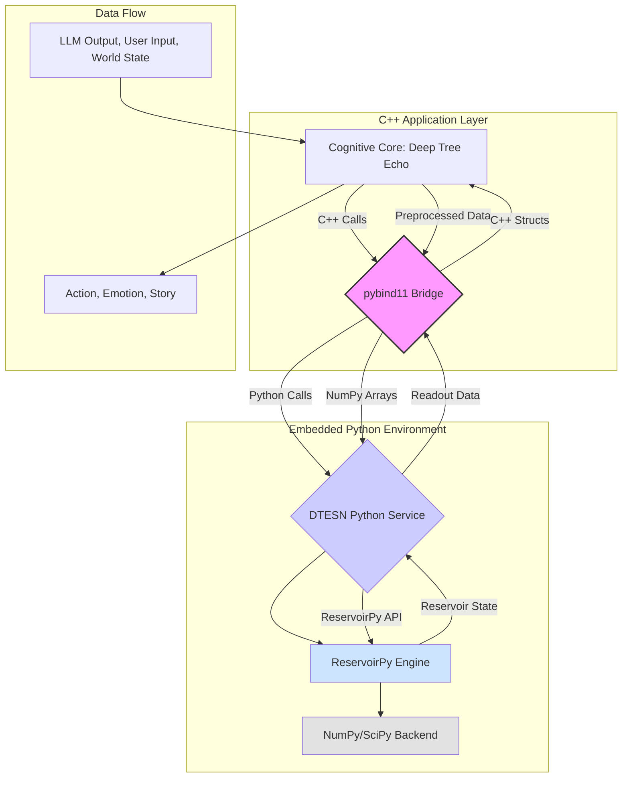

# DTESN: ReservoirPy Integration Strategy

**Date**: December 28, 2025
**Project**: `un9n` - Cognitive Core Implementation

## 1. The Challenge: Bridging Python and C++

The foundational DTESN architecture relies on reservoir computing, and the reference implementation is **ReservoirPy**, a powerful and flexible Python library. However, the existing `un9n` project and the high-performance mobile AI stack are predominantly C++ based. This creates a critical integration challenge: how to make a Python library the cognitive core of a C++ application, especially in a performance-sensitive mobile environment.

Directly rewriting ReservoirPy in C++ would be a monumental effort, discarding a mature and well-tested codebase. Therefore, the optimal strategy is to **create a robust bridge** that allows the C++ components of Deep Tree Echo to seamlessly interact with the Python-based ReservoirPy engine.

## 2. The Solution: A Hybrid Python/C++ Architecture

We will adopt a hybrid architecture where the DTESN, powered by ReservoirPy, runs in an embedded Python environment, while the rest of the application (LLM inference, UI, multi-modal I/O) remains in high-performance C++.

### 2.1. The Bridge: `pybind11`

The primary tool for this integration will be **`pybind11`**, a lightweight, header-only library that exposes C++ types in Python and vice versa. It allows for the creation of seamless, high-performance bindings between the two languages.

### 2.2. Architectural Diagram

## 3. Implementation Plan

The integration will be executed in three main steps:

### 3.1. Step 1: Create the DTESN Python Service

First, we will create a Python script that encapsulates all the ReservoirPy logic. This script will act as a dedicated service for managing the DTESN.

*   **`DTESNService.py`**:
    *   **Initialization**: Defines and initializes the Deep Tree Echo State Network using ReservoirPy, based on the architecture described in the `dtesn_architecture.md` document (P-System nested reservoirs, B-Series tree readouts).
    *   **`train()` function**: Implements the logic for training the readout layers (the "Agentic Forests") based on input data.
    *   **`predict()` function**: Takes a new input signal, feeds it into the reservoir, and returns the output from the trained readout layers.
    *   **State Management**: Manages the internal state of the reservoir over time.

### 3.2. Step 2: Build the `pybind11` Bridge

Next, we will create the C++ bindings that expose the `DTESNService.py` to the C++ application.

*   **`dtesn_bindings.cpp`**:
    *   **Include `pybind11/embed.h`**: This allows for the creation of an embedded Python interpreter within the C++ application.
    *   **Module Import**: Imports the `DTESNService` Python module.
    *   **Wrapper Functions**: Creates C++ functions that wrap the Python functions:
        *   `void initialize_dtesn()`: Calls the Python initialization logic.
        *   `void train_dtesn(const std::vector<float>& training_data, const std::vector<float>& target_data)`: Converts C++ vectors to NumPy arrays and calls the `train()` function in Python.
        *   `std::vector<float> predict_dtesn(const std::vector<float>& input_data)`: Converts C++ vectors to NumPy arrays, calls the `predict()` function, and converts the resulting NumPy array back to a C++ vector.

### 3.3. Step 3: Integrate into the Deep Tree Echo Core

Finally, we will integrate the C++ bindings into the main Deep Tree Echo cognitive core.

*   **`UCognitiveCoreComponent.cpp`**:
    *   **Initialization**: Calls `initialize_dtesn()` when the application starts.
    *   **Training Loop**: Implements the logic for periodically training the DTESN based on the interaction history stored in the Hypergraph Memory.
    *   **Inference Loop**: In the main cognitive loop, the output from the LLM, user inputs, and other world state information will be fed into `predict_dtesn()`. The output of the DTESN (representing the character's emotional state, emergent goals, etc.) will then be used to modulate the LLM's next prompt, creating a continuous feedback loop between the reasoning engine (LLM) and the affective core (DTESN).

## 4. Performance and Dependencies

*   **Dependencies**: This approach requires embedding a Python interpreter into the mobile application. This will increase the application's size but is a necessary trade-off for leveraging ReservoirPy. We will need to package a minimal Python environment with the required libraries (Python, NumPy, SciPy, ReservoirPy).
*   **Performance**: The use of `pybind11` and direct NumPy array manipulation minimizes the data conversion overhead between C++ and Python. The primary performance bottleneck will be the Python code itself. However, since ReservoirPy is built on NumPy, which is a highly optimized C library, the performance should be acceptable for a mobile environment, especially since the DTESN does not need to run on every single frame.

This hybrid strategy provides a clear and pragmatic path to realizing the full vision of the DTESN, combining the flexibility of Python's scientific ecosystem with the performance of a C++ application core.
